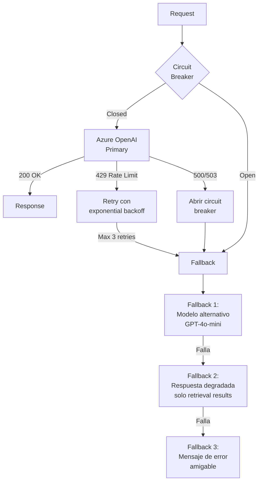
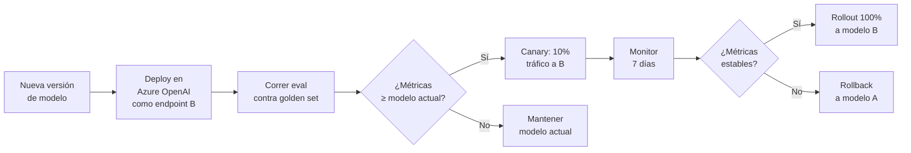

# 07 — Observabilidad & LLMOps

> **Proyecto:** Legal Ai Ar | **Categoría:** Observability & LLM Operations
> **Estado:** Parcialmente definido (Application Insights + Serilog en F00-W01)
> **Última actualización:** Mayo 2026

---

## 1. Descripción

Operar un sistema de IA en producción requiere observabilidad específica que va más allá del APM tradicional: tracing de cadenas de agentes, monitoreo de consumo de tokens, detección de degradación de calidad, y estrategias de caching y resiliencia para las APIs de LLM.

LLMOps (LLM Operations) es la disciplina que cubre el ciclo de vida operativo de modelos de lenguaje en producción: deploy, monitoreo, versionado, fallback, y optimización de costos.

---

## 2. Decisiones Técnicas

### 2.1 Stack de observabilidad

| Alternativa | Pros | Contras | Decisión |
|---|---|---|---|
| **Application Insights + Serilog** | Ya en el stack. Nativo Azure. Distributed tracing. Alertas. Dashboards. | No tiene conceptos nativos de LLM (tokens, prompts, completions). Requiere custom telemetry. | **Elegido como base** |
| **LangSmith / LangFuse** | Diseñado para LLM observability. Tracing de chains. Prompt versioning. Eval integrado. | Servicio externo. Datos sensibles fuera de Azure. Costo adicional. Python-first. | Descartado (datos sensibles) |
| **OpenTelemetry + custom exporter** | Estándar abierto. Semantic conventions para GenAI (draft). Portable. | Las conventions de GenAI son draft (no estables). Más setup manual. | **Elegido como capa de instrumentación** |
| **Semantic Kernel Telemetry** | Built-in en SK. Emite traces de planificación, tool calls, completions. Compatible con OpenTelemetry. | Solo cubre la capa de SK, no el pipeline completo. | **Elegido — se integra con App Insights** |

**Decisión:** OpenTelemetry como estándar de instrumentación → Application Insights como backend → Semantic Kernel telemetry como fuente de traces de agentes. Custom metrics para token usage y calidad.

### 2.2 Estructura del tracing distribuido

```mermaid
flowchart TB
    subgraph "Trace: user-query-12345"
        A[Span: HTTP Request<br/>POST /api/chat] --> B[Span: Router<br/>classify intent]
        B --> C[Span: Agent Normativo<br/>process query]
        C --> D[Span: Query Rewrite<br/>LLM call #1]
        D --> E[Span: Hybrid Search<br/>AI Search call]
        E --> F[Span: Graph Enrichment<br/>SQL Graph query]
        F --> G[Span: LLM Re-rank<br/>LLM call #2]
        G --> H[Span: Generate Response<br/>LLM call #3]
        H --> I[Span: Citation Verify<br/>LLM call #4]
        I --> J[Span: HTTP Response<br/>SSE stream]
    end
```



### 2.3 Custom metrics para LLM

```csharp
// Pseudo-código de telemetría custom
public class LlmTelemetry
{
    private static readonly Meter s_meter = new("Legal Ai Ar.LLM");
    
    // Contadores
    private static readonly Counter<long> s_tokensInput = 
        s_meter.CreateCounter<long>("llm.tokens.input", "tokens");
    private static readonly Counter<long> s_tokensOutput = 
        s_meter.CreateCounter<long>("llm.tokens.output", "tokens");
    private static readonly Counter<long> s_llmCalls = 
        s_meter.CreateCounter<long>("llm.calls.total");
    
    // Histogramas
    private static readonly Histogram<double> s_latency = 
        s_meter.CreateHistogram<double>("llm.latency", "ms");
    private static readonly Histogram<double> s_costPerQuery = 
        s_meter.CreateHistogram<double>("llm.cost.per_query", "usd");
    
    // Gauges via UpDownCounter
    private static readonly UpDownCounter<long> s_activeRequests = 
        s_meter.CreateUpDownCounter<long>("llm.requests.active");

    public void RecordCompletion(string model, string agent, int inputTokens, 
                                  int outputTokens, double latencyMs)
    {
        var tags = new TagList
        {
            { "model", model },
            { "agent", agent }
        };
        s_tokensInput.Add(inputTokens, tags);
        s_tokensOutput.Add(outputTokens, tags);
        s_llmCalls.Add(1, tags);
        s_latency.Record(latencyMs, tags);
        
        var cost = CalculateCost(model, inputTokens, outputTokens);
        s_costPerQuery.Record(cost, tags);
    }
}
```

---

## 3. Semantic Caching

### 3.1 Estrategia

| Alternativa | Pros | Contras | Decisión |
|---|---|---|---|
| **Sin cache** | Simple. Siempre datos frescos. | Costo alto: misma query = mismos tokens. Latencia innecesaria. | Descartado |
| **Cache exacto (key = query hash)** | Simple. Rápido. Determinístico. | Solo matchea queries idénticas. "¿Qué dice el art 245?" ≠ "Art. 245 LCT?" | Insuficiente solo |
| **Semantic cache (key = embedding)** | Queries similares comparten cache. Alta tasa de hit. | Requiere embedding de cada query ($). Riesgo de servir respuesta incorrecta para query similar pero distinta. | **Elegido con threshold alto** |
| **Azure Redis + semantic** | Redis como store. Embedding similarity para match. TTL configurable. | Servicio adicional. | Evaluado — usar Table Storage primero |

**Decisión:** Semantic cache con Azure Table Storage. Embedding de la query → buscar en cache con cosine similarity > 0.95. TTL de 24h para resultados de búsqueda, 1h para respuestas de agentes (la KB puede actualizarse).

### 3.2 Qué se cachea y qué no

| Operación | ¿Cache? | TTL | Justificación |
|---|---|---|---|
| Embedding de query | Sí | 7 días | Mismo texto = mismo embedding siempre |
| Hybrid Search results | Sí | 24h | Los índices se actualizan diariamente |
| Graph enrichment | Sí | 24h | El grafo cambia solo con ingesta |
| LLM query rewrite | Sí | 7 días | Misma query = misma reescritura |
| LLM response (agente) | Sí (semantic) | 1h | Puede depender del contexto actualizado |
| LLM re-ranking | No | — | Depende del contexto recuperado |

---

## 4. Resiliencia: Fallback & Circuit Breaker

### 4.1 Patrones de resiliencia



### 4.2 Configuración con Polly (.NET)

```csharp
// Pseudo-configuración de resiliencia con Polly v8
services.AddHttpClient("AzureOpenAI")
    .AddResilienceHandler("llm-pipeline", builder =>
    {
        // Retry con exponential backoff para 429
        builder.AddRetry(new RetryStrategyOptions<HttpResponseMessage>
        {
            MaxRetryAttempts = 3,
            Delay = TimeSpan.FromSeconds(2),
            BackoffType = DelayBackoffType.Exponential,
            ShouldHandle = new PredicateBuilder<HttpResponseMessage>()
                .HandleResult(r => r.StatusCode == HttpStatusCode.TooManyRequests)
        });
        
        // Circuit breaker para errores de servidor
        builder.AddCircuitBreaker(new CircuitBreakerStrategyOptions<HttpResponseMessage>
        {
            FailureRatio = 0.5,
            MinimumThroughput = 10,
            SamplingDuration = TimeSpan.FromSeconds(30),
            BreakDuration = TimeSpan.FromSeconds(60)
        });
        
        // Timeout global
        builder.AddTimeout(TimeSpan.FromSeconds(30));
    });
```

---

## 5. Model Versioning & A/B Deploy

### 5.1 Estrategia de versionado de modelos

| Aspecto | Estrategia |
|---|---|
| **Modelo principal** | GPT-4o (versión fijada, ej: `2024-08-06`) |
| **Modelo económico** | GPT-4o-mini para tareas auxiliares (rewrite, classify, enrich) |
| **Actualización** | No actualizar automáticamente. Testear nueva versión contra golden set antes de migrar. |
| **Rollback** | Mantener deployment anterior activo en Azure OpenAI. Cambio de endpoint vía config (no deploy). |

### 5.2 Flujo de actualización de modelo



---

## 6. Dashboards

### 6.1 Dashboard operativo (Application Insights)

| Panel | Métricas | Granularidad |
|---|---|---|
| **LLM Usage** | Tokens in/out por modelo, calls/min, costo acumulado | 1 min |
| **Latencia** | P50/P95/P99 por agente, por operación (search, rewrite, response) | 5 min |
| **Errores** | Rate de 429, 500, timeouts. Circuit breaker state. | 1 min |
| **Calidad** | Faithfulness score, citation accuracy, thumbs up rate | 1 hora |
| **Cache** | Hit rate, miss rate, cache size | 5 min |
| **Ingesta** | Docs procesados/hora, errores, dead letter queue size | 15 min |

### 6.2 Alertas

| Alerta | Condición | Severidad | Acción |
|---|---|---|---|
| High error rate | > 5% de requests con error en 5 min | Crítica | PagerDuty → on-call |
| Cost spike | Gasto diario > 150% del promedio | Alta | Email a tech lead |
| Latency degradation | P95 > 8s por 10 min | Alta | Investigar + considerar fallback |
| Circuit breaker open | Cualquier circuit breaker se abre | Crítica | Verificar Azure OpenAI status |
| Quality drop | Faithfulness < 0.90 en ventana de 4h | Media | Revisar cambios recientes |
| Cache miss spike | Hit rate < 50% por 1h | Baja | Verificar TTLs y warming |

---

## 7. Ítems Pendientes de Definición

- [ ] Implementar custom telemetry para LLM calls (tokens, latencia, costo)
- [ ] Configurar Semantic Kernel telemetry con OpenTelemetry → App Insights
- [ ] Implementar semantic caching con Table Storage
- [ ] Configurar Polly para retry + circuit breaker en HttpClient de Azure OpenAI
- [ ] Crear dashboards en Application Insights (LLM Usage, Latencia, Errores, Calidad)
- [ ] Definir alertas y routing (email, Teams, PagerDuty)
- [ ] Implementar el pipeline de canary deploy para cambios de modelo
- [ ] Definir política de retención de logs (¿30 días? ¿90 días?)
- [ ] Evaluar si agregar Azure Redis Cache para semantic caching de alto volumen
- [ ] Crear runbook de troubleshooting de incidentes de LLM

---

## 8. Referencias

- [OpenTelemetry — Semantic Conventions for GenAI](https://opentelemetry.io/docs/specs/semconv/gen-ai/)
- [Semantic Kernel — Telemetry](https://learn.microsoft.com/en-us/semantic-kernel/concepts/enterprise-readiness/observability/)
- [Polly v8 — Resilience Pipelines](https://www.thepollyproject.org/)
- [Application Insights — Custom Metrics](https://learn.microsoft.com/en-us/azure/azure-monitor/app/api-custom-events-metrics)

---

*07 — Observabilidad & LLMOps — Legal Ai Ar*
