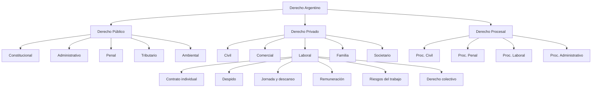
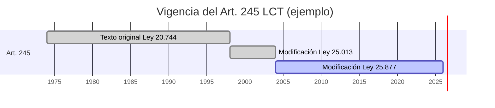
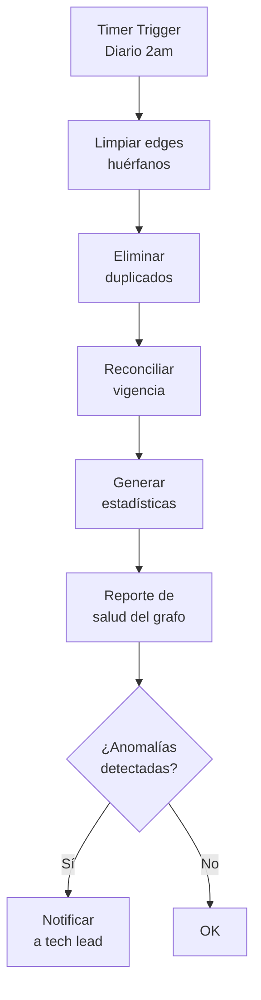
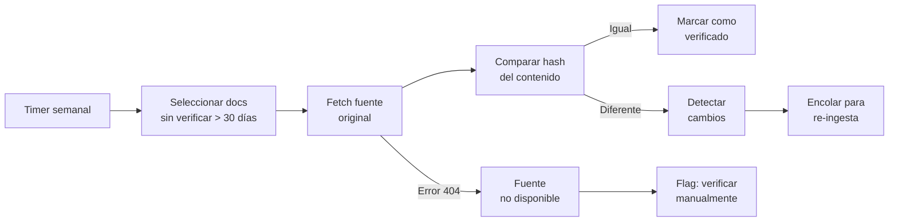
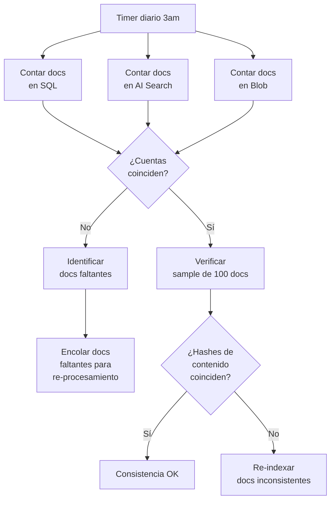

# 09 — Data & Knowledge Management

> **Proyecto:** Legal Ai Ar | **Categoría:** Data & Knowledge Management
> **Estado:** Parcialmente definido (SQL Graph + Ontología en F00-W01)
> **Última actualización:** Mayo 2026

---

## 1. Descripción

El conocimiento legal argentino no es estático: las normas se modifican, derogan y reglamentan constantemente. La jurisprudencia evoluciona con nuevos fallos que cambian criterios interpretativos. El sistema de Knowledge Management de Legal Ai Ar debe manejar esta naturaleza temporal y relacional del derecho, garantizando que el conocimiento en la KB esté actualizado, consistente entre los múltiples stores (SQL, AI Search, Blob, Graph), y sea trazable hasta su fuente original.

---

## 2. Decisiones Técnicas

### 2.1 Taxonomía legal controlada

| Alternativa | Pros | Contras | Decisión |
|---|---|---|---|
| **Taxonomía libre (tags del usuario)** | Flexible. Sin mantenimiento. Los usuarios tagean como quieren. | Inconsistencia: "laboral" vs "trabajo" vs "empleo". Sin jerarquía. Búsqueda imprecisa. | Descartado |
| **Taxonomía fija (hardcoded)** | Consistente. Predecible. | Rígida: agregar una nueva rama del derecho requiere cambio de código. No escala. | Descartado |
| **Taxonomía controlada (configurable)** | Consistente + flexible. UI de admin para gestionar. Jerárquica. Sinónimos. | Requiere mantenimiento por alguien con conocimiento legal. | **Elegido** |
| **Tesauro estándar (UNESCO / LoC)** | Estándar internacional. Interoperable. | No cubre especificidades del derecho argentino (fueros, jurisdicciones, tipos procesales). Está en inglés. | Inspiración, no adopción directa |

**Decisión:** Taxonomía controlada propia, inspirada en las clasificaciones de SAIJ y la ontología legal ya definida. Gestionable desde UI admin. Con soporte de sinónimos para mejorar el retrieval.

### 2.2 Estructura de la taxonomía



### 2.3 Schema de taxonomía

```sql
CREATE TABLE TaxonomiaLegal (
    Id INT PRIMARY KEY IDENTITY,
    Codigo NVARCHAR(20) NOT NULL UNIQUE,       -- "LAB.DESP" (laboral > despido)
    Nombre NVARCHAR(200) NOT NULL,             -- "Despido"
    NombreCompleto NVARCHAR(500),              -- "Derecho Privado > Laboral > Despido"
    PadreId INT FK REFERENCES TaxonomiaLegal(Id),
    Nivel INT NOT NULL,                        -- 0=raíz, 1=rama, 2=sub-rama, 3=tema
    Sinonimos NVARCHAR(MAX),                   -- JSON: ["cesantía", "extinción del contrato"]
    Descripcion NVARCHAR(500),
    EstaActivo BIT DEFAULT 1,
    Orden INT DEFAULT 0,
    FechaCreacion DATETIME2 DEFAULT GETUTCDATE()
);

CREATE INDEX IX_Taxonomia_Padre ON TaxonomiaLegal(PadreId);
CREATE INDEX IX_Taxonomia_Codigo ON TaxonomiaLegal(Codigo);

-- Tabla de asociación N:M con entidades
CREATE TABLE EntidadTaxonomia (
    Id INT PRIMARY KEY IDENTITY,
    EntidadTipo NVARCHAR(50) NOT NULL,         -- "norma" | "jurisprudencia" | "doctrina"
    EntidadId INT NOT NULL,
    TaxonomiaId INT FK REFERENCES TaxonomiaLegal(Id),
    Confianza DECIMAL(3,2) DEFAULT 1.00,       -- 1.0=manual, <1.0=automático (LLM)
    AsignadoPor NVARCHAR(50),                  -- "llm" | "usuario" | "ingesta"
    FechaAsignacion DATETIME2 DEFAULT GETUTCDATE(),
    UNIQUE(EntidadTipo, EntidadId, TaxonomiaId)
);
```

### 2.4 Sinónimos para retrieval

Los sinónimos de la taxonomía se usan en dos momentos:

1. **En ingesta:** Al clasificar un documento, se buscan coincidencias con sinónimos para asignar categorías automáticamente
2. **En query time:** Al buscar, se expande la query con sinónimos de la taxonomía seleccionada

```json
// Ejemplo de sinónimos para "Despido"
{
  "codigo": "LAB.DESP",
  "nombre": "Despido",
  "sinonimos": [
    "cesantía",
    "extinción del contrato",
    "rescisión del vínculo laboral",
    "desvinculación",
    "distracto"
  ]
}
```

---

## 3. Temporal Versioning (Vigencia Legal)

### 3.1 Problema

El derecho tiene una dimensión temporal única: un artículo puede haber tenido 5 versiones distintas a lo largo de los años, y un abogado puede necesitar saber qué decía la norma en una fecha específica (por ejemplo, al momento de un hecho ilícito o de la firma de un contrato).

### 3.2 Modelo de datos temporal

| Alternativa | Pros | Contras | Decisión |
|---|---|---|---|
| **Solo versión actual** | Simple. Menos storage. Menos complejidad. | Pierde historia. No se puede consultar "¿qué decía en 2015?" | Descartado |
| **Soft versioning (campo vigente/derogado)** | Simple. Flag binario. | No guarda versiones intermedias. No soporta consultas temporales. | Insuficiente |
| **Temporal tables (SQL Server)** | System-versioned temporal tables nativas. Queries con `FOR SYSTEM_TIME AS OF`. Sin overhead de desarrollo. | Solo trackea cambios desde que se activó. No reconstruye historia pre-existente. | **Elegido para tracking automático** |
| **Custom version table** | Control total. Puede reconstruir historia pre-sistema. | Más desarrollo. Queries más complejas. | **Elegido para historia legal** |

**Decisión dual:**
- **SQL Temporal Tables:** Para auditar cambios en la DB desde el día 1 (automático, sin código)
- **Custom versioning (ArticuloVersion):** Para la historia legal pre-sistema (reconstruida desde InfoLEG textos consolidados)

### 3.3 SQL Temporal Tables

```sql
-- Activar temporal tables en la tabla de artículos
ALTER TABLE Articulo
ADD 
    SysStartTime DATETIME2 GENERATED ALWAYS AS ROW START NOT NULL 
        DEFAULT SYSUTCDATETIME(),
    SysEndTime DATETIME2 GENERATED ALWAYS AS ROW END NOT NULL 
        DEFAULT CONVERT(DATETIME2, '9999-12-31 23:59:59.9999999'),
    PERIOD FOR SYSTEM_TIME (SysStartTime, SysEndTime);

ALTER TABLE Articulo
SET (SYSTEM_VERSIONING = ON (HISTORY_TABLE = dbo.ArticuloHistory));

-- Consultar qué decía un artículo en una fecha específica
SELECT * 
FROM Articulo FOR SYSTEM_TIME AS OF '2020-01-01T00:00:00'
WHERE NormaId = 1 AND NumeroArticulo = '245';

-- Ver todo el historial de cambios de un artículo
SELECT *, SysStartTime, SysEndTime
FROM Articulo FOR SYSTEM_TIME ALL
WHERE NormaId = 1 AND NumeroArticulo = '245'
ORDER BY SysStartTime;
```

### 3.4 Diagrama de vigencia



---

## 4. Knowledge Graph Maintenance

### 4.1 Integridad del grafo

El SQL Graph de Legal Ai Ar puede acumular inconsistencias con el tiempo: edges que apuntan a normas eliminadas, relaciones duplicadas, nodos huérfanos. Se requiere un proceso de mantenimiento periódico.

### 4.2 Checks de integridad

| Check | Query | Frecuencia | Acción |
|---|---|---|---|
| **Edges huérfanos** | Edges cuyo nodo origen o destino fue eliminado | Diaria | Eliminar edge |
| **Duplicados** | Dos edges del mismo tipo entre los mismos nodos | Diaria | Merge (mantener el más reciente) |
| **Circularidad** | A modifica B y B modifica A | Semanal | Flag para revisión humana |
| **Nodos aislados** | Normas sin ningún edge (ni entrante ni saliente) | Semanal | Re-ejecutar Graph Builder |
| **Coherencia de vigencia** | Norma con edge Deroga entrante pero marcada como vigente | Diaria | Actualizar flag de vigencia |
| **Profundidad excesiva** | Cadenas de modificaciones de > 10 niveles | Mensual | Verificar si es correcto o error de ingesta |

### 4.3 Job de mantenimiento



### 4.4 Estadísticas del grafo

```sql
-- Dashboard de salud del Knowledge Graph
SELECT 
    'Nodos: Normas' AS Metrica, COUNT(*) AS Valor FROM NormaJuridica
UNION ALL
SELECT 'Nodos: Jurisprudencia', COUNT(*) FROM Jurisprudencia
UNION ALL
SELECT 'Nodos: Artículos', COUNT(*) FROM Articulo
UNION ALL
SELECT 'Edges: Modifica', COUNT(*) FROM Modifica
UNION ALL
SELECT 'Edges: Deroga', COUNT(*) FROM Deroga
UNION ALL
SELECT 'Edges: Reglamenta', COUNT(*) FROM Reglamenta
UNION ALL
SELECT 'Edges: Interpreta', COUNT(*) FROM Interpreta
UNION ALL
SELECT 'Edges: Aplica', COUNT(*) FROM Aplica
UNION ALL
SELECT 'Edges: CitaJurisprudencia', COUNT(*) FROM CitaJurisprudencia
UNION ALL
SELECT 'Normas vigentes', COUNT(*) FROM NormaJuridica WHERE EstaVigente = 1
UNION ALL
SELECT 'Normas sin edges', COUNT(*) FROM NormaJuridica n
    WHERE NOT EXISTS (
        SELECT 1 FROM Modifica m WHERE n.$node_id = m.$from_id OR n.$node_id = m.$to_id
        UNION ALL
        SELECT 1 FROM Deroga d WHERE n.$node_id = d.$from_id OR n.$node_id = d.$to_id
        UNION ALL
        SELECT 1 FROM Reglamenta r WHERE n.$node_id = r.$from_id OR n.$node_id = r.$to_id
    );
```

---

## 5. Data Lineage & Provenance

### 5.1 Trazabilidad de origen

Cada dato en la KB debe poder rastrear su origen hasta la fuente original. Esto es crítico en el dominio legal porque un abogado necesita saber de dónde viene la información para evaluar su confiabilidad.

### 5.2 Schema de provenance

```sql
CREATE TABLE DataProvenance (
    Id INT PRIMARY KEY IDENTITY,
    EntidadTipo NVARCHAR(50) NOT NULL,       -- "norma" | "articulo" | "jurisprudencia"
    EntidadId INT NOT NULL,
    FuenteOrigen NVARCHAR(100) NOT NULL,     -- "SAIJ" | "InfoLEG" | "BoletinOficial" | "Manual"
    UrlOrigen NVARCHAR(1000),                -- URL de la fuente original
    BlobUrl NVARCHAR(500),                   -- URL del documento original en Blob Storage
    FechaObtencion DATETIME2 NOT NULL,       -- Cuándo se obtuvo de la fuente
    FechaUltimaVerificacion DATETIME2,       -- Última vez que se verificó contra la fuente
    MetodoIngesta NVARCHAR(50),              -- "scraper_auto" | "carga_manual" | "api"
    HashContenido NVARCHAR(64),              -- SHA-256 del contenido original
    VersionIngesta NVARCHAR(20),             -- Versión del pipeline que lo procesó
    MetadataExtra NVARCHAR(MAX),             -- JSON: datos adicionales de la fuente
    UNIQUE(EntidadTipo, EntidadId, FuenteOrigen)
);

CREATE INDEX IX_Provenance_Entidad ON DataProvenance(EntidadTipo, EntidadId);
```

### 5.3 Verificación periódica de fuentes



---

## 6. Consistencia Cross-Store

### 6.1 Problema de los múltiples stores

Legal Ai Ar tiene datos distribuidos en 4 stores que deben estar sincronizados:

| Store | Qué contiene | Momento de escritura |
|---|---|---|
| **Azure SQL** | Datos estructurados (tablas) + Graph (edges) | Paso 3 del pipeline (Almacenar) |
| **Azure AI Search** | Índices de búsqueda + embeddings | Paso 6 (Indexar) |
| **Blob Storage** | Documentos originales (PDF, HTML) | Paso 3 (Almacenar) |
| **Table Storage** | Cache de embeddings, metadata auxiliar | Paso 5 (Embeber) |

### 6.2 Estrategia de consistencia

| Alternativa | Pros | Contras | Decisión |
|---|---|---|---|
| **Consistencia eventual (event-driven)** | Desacoplado. Resiliente. Cada store se actualiza independientemente via colas. | Ventana de inconsistencia (segundos a minutos). Un store puede fallar sin que los otros lo sepan. | **Elegido** |
| **Transacción distribuida (2PC)** | Consistencia fuerte. Todo o nada. | Complejidad extrema. No soportado entre SQL, AI Search y Blob. Peor performance. | Descartado |
| **Saga pattern** | Compensación automática si un paso falla. Eventualmente consistente con rollback. | Complejidad de implementar compensaciones para cada store. | **Elegido para operaciones críticas** |

### 6.3 Reconciliación periódica



### 6.4 Monitor de consistencia

```sql
-- Vista de consistencia cross-store
CREATE VIEW vw_ConsistenciaStores AS
SELECT 
    n.Id AS NormaId,
    n.Denominacion,
    CASE WHEN n.Id IS NOT NULL THEN 1 ELSE 0 END AS EnSQL,
    CASE WHEN p.BlobUrl IS NOT NULL THEN 1 ELSE 0 END AS EnBlob,
    CASE WHEN p.BlobUrl IS NOT NULL THEN 1 ELSE 0 END AS TieneProvenance,
    -- AI Search se verifica via API, no SQL
    n.FechaUltimaActualizacion AS UltimaActSQL,
    p.FechaUltimaVerificacion AS UltimaVerificacion
FROM NormaJuridica n
LEFT JOIN DataProvenance p ON p.EntidadTipo = 'norma' AND p.EntidadId = n.Id;
```

---

## 7. Ejemplo Concreto: Ciclo de vida de una norma modificatoria

**Escenario:** Se publica en el Boletín Oficial una nueva ley que modifica 3 artículos de la Ley 20.744 (LCT).

```
1. INGESTA: Scraper detecta nueva ley en BO → la ingesta como norma nueva
2. CLASIFICACIÓN: LLM clasifica como "laboral > contrato individual"
3. NER: Detecta referencias: "Modifícase el art. 245 de la Ley 20.744"
4. GRAPH BUILDER: Crea edge Modifica(nueva_ley → Ley 20.744)
5. TEMPORAL:
   a. Crea ArticuloVersion para los 3 artículos con FechaVigenciaHasta = hoy
   b. Crea nuevas ArticuloVersion con el nuevo texto y FechaVigenciaDesde = hoy
   c. Actualiza TextoVigente en tabla Articulo
6. TAXONOMÍA: Hereda taxonomías del artículo padre + agrega nuevas si corresponde
7. EMBEDDINGS: Re-genera embeddings de los 3 artículos modificados
8. AI SEARCH: Re-indexa los 3 artículos en idx-articulos
9. PROVENANCE: Registra origen (BO, fecha, URL) para la nueva ley
10. CONSISTENCIA: Verifica que SQL, AI Search y Blob están sincronizados
11. NOTIFICACIÓN: Alerta a abogados con expedientes que citan art. 245
```

---

## 8. Ítems Pendientes de Definición

- [ ] Crear tabla TaxonomiaLegal con la jerarquía completa del derecho argentino
- [ ] Poblar taxonomía inicial basada en clasificaciones de SAIJ
- [ ] Implementar sinónimos por categoría para query expansion
- [ ] Activar SQL Temporal Tables en tablas principales (Articulo, NormaJuridica)
- [ ] Crear tabla ArticuloVersion para historia legal pre-sistema
- [ ] Implementar tabla DataProvenance y registrar origen en ingesta
- [ ] Crear job de mantenimiento de grafo (limpieza + reconciliación)
- [ ] Implementar reconciliación cross-store (SQL vs AI Search vs Blob)
- [ ] Diseñar UI admin de taxonomía (CRUD + reordenar + sinónimos)
- [ ] Definir política de re-verificación de fuentes (¿cada 30 días?)
- [ ] Implementar alertas de cambios en normas que afectan expedientes activos
- [ ] Crear dashboard de salud del Knowledge Graph

---

## 9. Referencias

- [SQL Server Temporal Tables](https://learn.microsoft.com/en-us/sql/relational-databases/tables/temporal-tables)
- [Azure SQL — Graph Processing](https://learn.microsoft.com/en-us/sql/relational-databases/graphs/sql-graph-overview)
- [SAIJ — Tesauro Jurídico](http://www.saij.gob.ar/tesauro)
- [Data Provenance — W3C PROV](https://www.w3.org/TR/prov-overview/)
- [Event-Driven Architecture — Microsoft](https://learn.microsoft.com/en-us/azure/architecture/guide/architecture-styles/event-driven)

---

*09 — Data & Knowledge Management — Legal Ai Ar*
