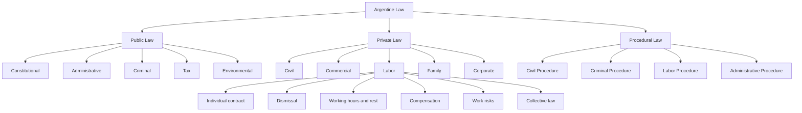
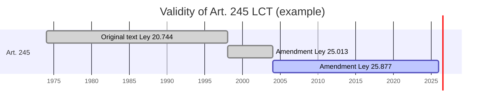
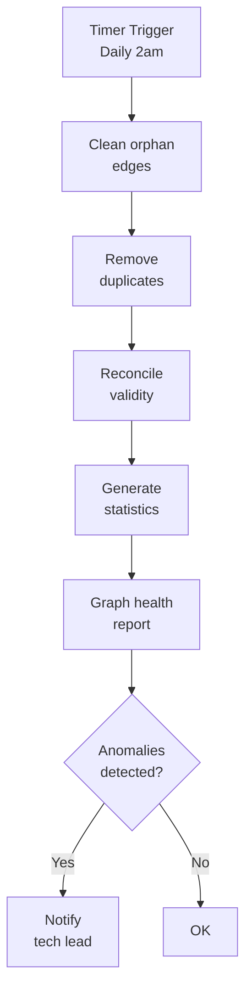
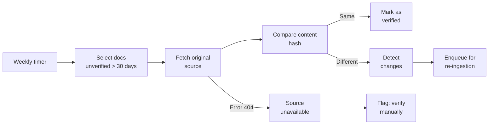
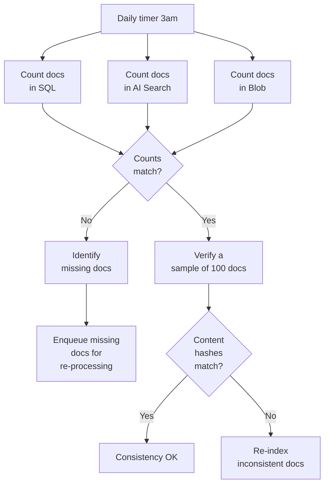

# 09 — Data & Knowledge Management

> **Project:** Legal Ai Ar | **Category:** Data & Knowledge Management
> **Status:** Partially defined (SQL Graph + Ontology in F00-W01)
> **Last updated:** May 2026

---

## 1. Description

Argentine legal knowledge is not static: norms are amended, repealed, and regulated constantly. Case law evolves with new rulings that change interpretive criteria. Legal Ai Ar's Knowledge Management system must handle this temporal and relational nature of the law, ensuring that the knowledge in the KB is up to date, consistent across the multiple stores (SQL, AI Search, Blob, Graph), and traceable back to its original source.

---

## 2. Technical Decisions

### 2.1 Controlled legal taxonomy

| Alternative | Pros | Cons | Decision |
|---|---|---|---|
| **Free taxonomy (user tags)** | Flexible. No maintenance. Users tag as they wish. | Inconsistency: "laboral" vs "trabajo" vs "empleo". No hierarchy. Imprecise search. | Discarded |
| **Fixed taxonomy (hardcoded)** | Consistent. Predictable. | Rigid: adding a new law branch requires a code change. Does not scale. | Discarded |
| **Controlled taxonomy (configurable)** | Consistent + flexible. Admin UI to manage it. Hierarchical. Synonyms. | Requires maintenance by someone with legal knowledge. | **Chosen** |
| **Standard thesaurus (UNESCO / LoC)** | International standard. Interoperable. | Does not cover Argentine law specifics (jurisdictions, procedure types). It is in English. | Inspiration, not direct adoption |

**Decision:** A proprietary controlled taxonomy, inspired by the SAIJ classifications and the already-defined legal ontology. Manageable from the admin UI. With synonym support to improve retrieval.

### 2.2 Taxonomy structure



### 2.3 Taxonomy schema

```sql
CREATE TABLE LegalTaxonomy (
    Id INT PRIMARY KEY IDENTITY,
    Code NVARCHAR(20) NOT NULL UNIQUE,         -- "LAB.DESP" (labor > dismissal)
    Name NVARCHAR(200) NOT NULL,               -- "Despido"
    FullName NVARCHAR(500),                    -- "Private Law > Labor > Dismissal"
    ParentId INT FK REFERENCES LegalTaxonomy(Id),
    Level INT NOT NULL,                        -- 0=root, 1=branch, 2=sub-branch, 3=topic
    Synonyms NVARCHAR(MAX),                    -- JSON: ["cesantía", "extinción del contrato"]
    Description NVARCHAR(500),
    IsActive BIT DEFAULT 1,
    SortOrder INT DEFAULT 0,
    CreatedAt DATETIME2 DEFAULT GETUTCDATE()
);

CREATE INDEX IX_Taxonomy_Parent ON LegalTaxonomy(ParentId);
CREATE INDEX IX_Taxonomy_Code ON LegalTaxonomy(Code);

-- N:M association table with entities
CREATE TABLE EntityTaxonomy (
    Id INT PRIMARY KEY IDENTITY,
    EntityType NVARCHAR(50) NOT NULL,          -- "norm" | "caseLaw" | "doctrine"
    EntityId INT NOT NULL,
    TaxonomyId INT FK REFERENCES LegalTaxonomy(Id),
    Confidence DECIMAL(3,2) DEFAULT 1.00,      -- 1.0=manual, <1.0=automatic (LLM)
    AssignedBy NVARCHAR(50),                   -- "llm" | "user" | "ingestion"
    AssignedAt DATETIME2 DEFAULT GETUTCDATE(),
    UNIQUE(EntityType, EntityId, TaxonomyId)
);
```

### 2.4 Synonyms for retrieval

The taxonomy synonyms are used at two points:

1. **At ingestion:** When classifying a document, matches against synonyms are searched to assign categories automatically
2. **At query time:** When searching, the query is expanded with synonyms of the selected taxonomy

```json
// Example synonyms for "Dismissal" (synonym values are Spanish legal terms)
{
  "code": "LAB.DESP",
  "name": "Despido",
  "synonyms": [
    "cesantía",
    "extinción del contrato",
    "rescisión del vínculo laboral",
    "desvinculación",
    "distracto"
  ]
}
```

---

## 3. Temporal Versioning (Legal Validity)

### 3.1 Problem

The law has a unique temporal dimension: an article may have had 5 different versions over the years, and a lawyer may need to know what the norm said on a specific date (for example, at the time of a tort or the signing of a contract).

### 3.2 Temporal data model

| Alternative | Pros | Cons | Decision |
|---|---|---|---|
| **Current version only** | Simple. Less storage. Less complexity. | Loses history. Cannot answer "what did it say in 2015?" | Discarded |
| **Soft versioning (in-force/repealed flag)** | Simple. Binary flag. | Does not keep intermediate versions. Does not support temporal queries. | Insufficient |
| **Temporal tables (SQL Server)** | Native system-versioned temporal tables. Queries with `FOR SYSTEM_TIME AS OF`. No development overhead. | Only tracks changes since it was enabled. Does not reconstruct pre-existing history. | **Chosen for automatic tracking** |
| **Custom version table** | Full control. Can reconstruct pre-system history. | More development. More complex queries. | **Chosen for legal history** |

**Dual decision:**
- **SQL Temporal Tables:** To audit DB changes from day 1 (automatic, no code)
- **Custom versioning (ArticleVersion):** For pre-system legal history (reconstructed from InfoLEG consolidated texts)

### 3.3 SQL Temporal Tables

```sql
-- Enable temporal tables on the articles table
ALTER TABLE Article
ADD
    SysStartTime DATETIME2 GENERATED ALWAYS AS ROW START NOT NULL
        DEFAULT SYSUTCDATETIME(),
    SysEndTime DATETIME2 GENERATED ALWAYS AS ROW END NOT NULL
        DEFAULT CONVERT(DATETIME2, '9999-12-31 23:59:59.9999999'),
    PERIOD FOR SYSTEM_TIME (SysStartTime, SysEndTime);

ALTER TABLE Article
SET (SYSTEM_VERSIONING = ON (HISTORY_TABLE = dbo.ArticleHistory));

-- Query what an article said on a specific date
SELECT *
FROM Article FOR SYSTEM_TIME AS OF '2020-01-01T00:00:00'
WHERE LegalNormId = 1 AND ArticleNumber = '245';

-- See the full change history of an article
SELECT *, SysStartTime, SysEndTime
FROM Article FOR SYSTEM_TIME ALL
WHERE LegalNormId = 1 AND ArticleNumber = '245'
ORDER BY SysStartTime;
```

### 3.4 Validity diagram



---

## 4. Knowledge Graph Maintenance

### 4.1 Graph integrity

Legal Ai Ar's SQL Graph can accumulate inconsistencies over time: edges pointing to deleted norms, duplicate relationships, orphan nodes. A periodic maintenance process is required.

### 4.2 Integrity checks

| Check | Query | Frequency | Action |
|---|---|---|---|
| **Orphan edges** | Edges whose source or target node was deleted | Daily | Delete edge |
| **Duplicates** | Two edges of the same type between the same nodes | Daily | Merge (keep the most recent) |
| **Circularity** | A amends B and B amends A | Weekly | Flag for human review |
| **Isolated nodes** | Norms with no edges (neither incoming nor outgoing) | Weekly | Re-run the Graph Builder |
| **Validity coherence** | Norm with an incoming Repeals edge but marked as in force | Daily | Update the validity flag |
| **Excessive depth** | Amendment chains of > 10 levels | Monthly | Verify whether it is correct or an ingestion error |

### 4.3 Maintenance job



### 4.4 Graph statistics

```sql
-- Knowledge Graph health dashboard
SELECT
    'Nodes: Norms' AS Metric, COUNT(*) AS Value FROM LegalNorm
UNION ALL
SELECT 'Nodes: Case law', COUNT(*) FROM CaseLaw
UNION ALL
SELECT 'Nodes: Articles', COUNT(*) FROM Article
UNION ALL
SELECT 'Edges: Amends', COUNT(*) FROM Amends
UNION ALL
SELECT 'Edges: Repeals', COUNT(*) FROM Repeals
UNION ALL
SELECT 'Edges: Regulates', COUNT(*) FROM Regulates
UNION ALL
SELECT 'Edges: Interprets', COUNT(*) FROM Interprets
UNION ALL
SELECT 'Edges: Applies', COUNT(*) FROM Applies
UNION ALL
SELECT 'Edges: CitesCaseLaw', COUNT(*) FROM CitesCaseLaw
UNION ALL
SELECT 'Norms in force', COUNT(*) FROM LegalNorm WHERE IsInForce = 1
UNION ALL
SELECT 'Norms with no edges', COUNT(*) FROM LegalNorm n
    WHERE NOT EXISTS (
        SELECT 1 FROM Amends m WHERE n.$node_id = m.$from_id OR n.$node_id = m.$to_id
        UNION ALL
        SELECT 1 FROM Repeals d WHERE n.$node_id = d.$from_id OR n.$node_id = d.$to_id
        UNION ALL
        SELECT 1 FROM Regulates r WHERE n.$node_id = r.$from_id OR n.$node_id = r.$to_id
    );
```

---

## 5. Data Lineage & Provenance

### 5.1 Source traceability

Every piece of data in the KB must be able to trace its origin back to the original source. This is critical in the legal domain because a lawyer needs to know where information comes from to assess its reliability.

### 5.2 Provenance schema

```sql
CREATE TABLE DataProvenance (
    Id INT PRIMARY KEY IDENTITY,
    EntityType NVARCHAR(50) NOT NULL,        -- "norm" | "article" | "caseLaw"
    EntityId INT NOT NULL,
    SourceOrigin NVARCHAR(100) NOT NULL,     -- "SAIJ" | "InfoLEG" | "OfficialGazette" | "Manual"
    SourceUrl NVARCHAR(1000),                -- URL of the original source
    BlobUrl NVARCHAR(500),                   -- URL of the original document in Blob Storage
    FetchedAt DATETIME2 NOT NULL,            -- When it was fetched from the source
    LastVerifiedAt DATETIME2,                -- Last time it was verified against the source
    IngestionMethod NVARCHAR(50),            -- "scraper_auto" | "manual_upload" | "api"
    ContentHash NVARCHAR(64),                -- SHA-256 of the original content
    IngestionVersion NVARCHAR(20),           -- Version of the pipeline that processed it
    ExtraMetadata NVARCHAR(MAX),             -- JSON: additional source data
    UNIQUE(EntityType, EntityId, SourceOrigin)
);

CREATE INDEX IX_Provenance_Entity ON DataProvenance(EntityType, EntityId);
```

### 5.3 Periodic source verification



---

## 6. Cross-Store Consistency

### 6.1 The multiple-store problem

Legal Ai Ar has data distributed across 4 stores that must stay synchronized:

| Store | What it contains | Write moment |
|---|---|---|
| **Azure SQL** | Structured data (tables) + Graph (edges) | Pipeline step 3 (Store) |
| **Azure AI Search** | Search indexes + embeddings | Step 6 (Index) |
| **Blob Storage** | Original documents (PDF, HTML) | Step 3 (Store) |
| **Table Storage** | Embedding cache, auxiliary metadata | Step 5 (Embed) |

### 6.2 Consistency strategy

| Alternative | Pros | Cons | Decision |
|---|---|---|---|
| **Eventual consistency (event-driven)** | Decoupled. Resilient. Each store updates independently via queues. | Inconsistency window (seconds to minutes). One store can fail without the others knowing. | **Chosen** |
| **Distributed transaction (2PC)** | Strong consistency. All or nothing. | Extreme complexity. Not supported across SQL, AI Search, and Blob. Worse performance. | Discarded |
| **Saga pattern** | Automatic compensation if a step fails. Eventually consistent with rollback. | Complexity of implementing compensations for each store. | **Chosen for critical operations** |

### 6.3 Periodic reconciliation



### 6.4 Consistency monitor

```sql
-- Cross-store consistency view
CREATE VIEW vw_StoreConsistency AS
SELECT
    n.Id AS LegalNormId,
    n.Name,
    CASE WHEN n.Id IS NOT NULL THEN 1 ELSE 0 END AS InSQL,
    CASE WHEN p.BlobUrl IS NOT NULL THEN 1 ELSE 0 END AS InBlob,
    CASE WHEN p.BlobUrl IS NOT NULL THEN 1 ELSE 0 END AS HasProvenance,
    -- AI Search is verified via API, not SQL
    n.LastUpdatedAt AS LastSqlUpdate,
    p.LastVerifiedAt AS LastVerification
FROM LegalNorm n
LEFT JOIN DataProvenance p ON p.EntityType = 'norm' AND p.EntityId = n.Id;
```

---

## 7. Concrete Example: Lifecycle of an amending norm

**Scenario:** A new law that amends 3 articles of Ley 20.744 (LCT) is published in the Official Gazette.

```
1. INGESTION: Scraper detects a new law in the Gazette → ingests it as a new norm
2. CLASSIFICATION: LLM classifies it as "labor > individual contract"
3. NER: Detects references: "Modifícase el art. 245 de la Ley 20.744"
4. GRAPH BUILDER: Creates an Amends(new_law → Ley 20.744) edge
5. TEMPORAL:
   a. Creates ArticleVersion for the 3 articles with ValidTo = today
   b. Creates new ArticleVersion with the new text and ValidFrom = today
   c. Updates CurrentText in the Article table
6. TAXONOMY: Inherits the parent article's taxonomies + adds new ones if applicable
7. EMBEDDINGS: Re-generates embeddings of the 3 amended articles
8. AI SEARCH: Re-indexes the 3 articles in idx-articles
9. PROVENANCE: Records the origin (Gazette, date, URL) for the new law
10. CONSISTENCY: Verifies that SQL, AI Search, and Blob are synchronized
11. NOTIFICATION: Alerts lawyers with case files that cite art. 245
```

---

## 8. Items Pending Definition

- [ ] Create the LegalTaxonomy table with the full Argentine law hierarchy
- [ ] Populate the initial taxonomy based on SAIJ classifications
- [ ] Implement per-category synonyms for query expansion
- [ ] Enable SQL Temporal Tables on the main tables (Article, LegalNorm)
- [ ] Create the ArticleVersion table for pre-system legal history
- [ ] Implement the DataProvenance table and record origin at ingestion
- [ ] Create the graph maintenance job (cleanup + reconciliation)
- [ ] Implement cross-store reconciliation (SQL vs AI Search vs Blob)
- [ ] Design the taxonomy admin UI (CRUD + reorder + synonyms)
- [ ] Define the source re-verification policy (every 30 days?)
- [ ] Implement alerts for changes in norms that affect active case files
- [ ] Create a Knowledge Graph health dashboard

---

## 9. References

- [SQL Server Temporal Tables](https://learn.microsoft.com/en-us/sql/relational-databases/tables/temporal-tables)
- [Azure SQL — Graph Processing](https://learn.microsoft.com/en-us/sql/relational-databases/graphs/sql-graph-overview)
- [SAIJ — Legal Thesaurus](http://www.saij.gob.ar/tesauro)
- [Data Provenance — W3C PROV](https://www.w3.org/TR/prov-overview/)
- [Event-Driven Architecture — Microsoft](https://learn.microsoft.com/en-us/azure/architecture/guide/architecture-styles/event-driven)

---

*09 — Data & Knowledge Management — Legal Ai Ar*
