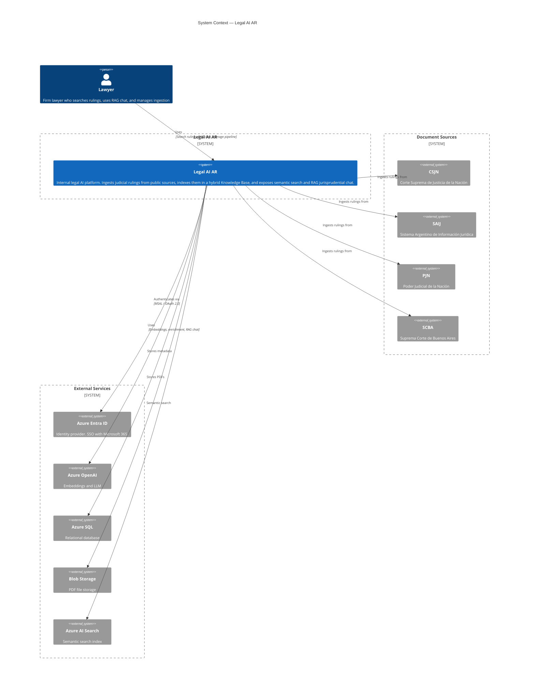
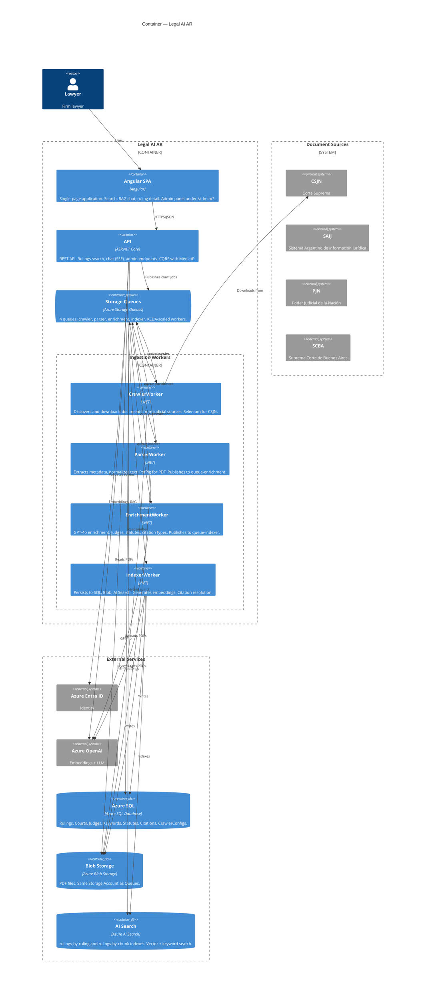
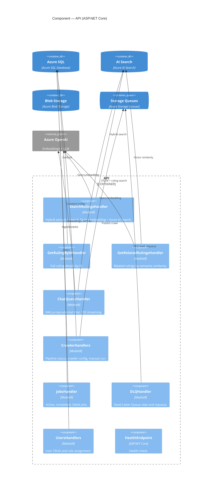

> ⚠️ **Imported from the MVP — pending review.** Carried over from `mvp/docs/architecture/` to
> preserve its content in the new structure. Not yet revised for current naming (`Legal Ai Ar` /
> `LegalAiAr.*`) or the cloud-only / platform `id_token` models. **Do not treat as definitive until
> reviewed.** Diagram sources live in `docs/technical/diagrams/`.

# C4 Architecture Diagrams — Legal AI AR

This document describes the C4 model diagrams for Legal AI AR and explains each level of abstraction. The C4 model uses four levels to describe software architecture, from the broadest (system context) to the most detailed (code). We document levels 1–3.

---

## Overview of the C4 Model

The [C4 model](https://c4model.com/) by Simon Brown provides a hierarchical way to visualize software architecture:

| Level | Diagram | Purpose |
|-------|---------|---------|
| **1** | System Context | Shows the system and its relationships with users and external systems |
| **2** | Container | Shows the high-level building blocks (applications, data stores) |
| **3** | Component | Shows the components inside a container |
| **4** | Code | Shows how components are implemented (optional; not documented here) |

Each level zooms into the previous one. Level 1 answers *“What does the system do and who uses it?”* Level 2 answers *“What are the main applications and data stores?”* Level 3 answers *“What are the main parts inside this application?”*

---

## Level 1 — System Context



### Purpose

The System Context diagram shows Legal AI AR as a single system and its relationships with:

- **Users** — who use the system
- **External systems** — third-party services and data sources the system depends on

### Elements

| Element | Description |
|---------|-------------|
| **Lawyer** | Firm lawyer who searches rulings, uses the RAG chat, and manages the ingestion pipeline |
| **Legal AI AR** | The system: internal legal AI platform that ingests judicial rulings, indexes them, and exposes semantic search and RAG chat |
| **Document Sources** | CSJN, SAIJ, PJN, SCBA — Argentine judicial sources from which rulings are ingested |
| **External Services** | Azure Entra ID (identity), Azure OpenAI (embeddings + LLM), Azure SQL (database), Blob Storage (PDFs), Azure AI Search (semantic index) |

### Relationships

- Lawyers **use** Legal AI AR (search, chat, admin).
- Legal AI AR **authenticates** via Azure Entra ID.
- Legal AI AR **ingests** rulings from Document Sources (CSJN, SAIJ, PJN, SCBA).
- Legal AI AR **uses** Azure OpenAI for embeddings and LLM.
- Legal AI AR **stores** metadata in Azure SQL, PDFs in Blob Storage, and indexes in Azure AI Search.

### When to Use

Use this diagram when explaining the system to stakeholders, onboarding new team members, or documenting scope and integrations.

---

## Level 2 — Container



### Purpose

The Container diagram zooms into Legal AI AR and shows its main deployable units:

- **Containers** — runnable applications (web app, API, workers)
- **ContainerDb** — databases and storage
- **ContainerQueue** — message queues

### Elements

| Element | Type | Technology | Description |
|---------|------|------------|-------------|
| **Angular SPA** | Container | Angular | Single-page app: search, RAG chat, ruling detail, admin panel (`/admin/*`) |
| **API** | Container | ASP.NET Core | REST API: rulings search, chat (SSE), admin endpoints. CQRS with MediatR |
| **CrawlerWorker** | Container | .NET | Discovers and downloads documents from judicial sources. Selenium for CSJN |
| **ParserWorker** | Container | .NET | Extracts metadata, normalizes text. PdfPig for PDF |
| **EnrichmentWorker** | Container | .NET | GPT-4o enrichment: judges, statutes, citation types |
| **IndexerWorker** | Container | .NET | Persists to SQL, Blob, AI Search. Generates embeddings. Citation resolution |
| **Storage Queues** | ContainerQueue | Azure Storage Queues | Four queues: `queue-crawler`, `queue-parser`, `queue-enrichment`, `queue-indexer` |
| **Document Sources** | System_Ext | — | CSJN, SAIJ, PJN, SCBA — judicial sources |
| **External Services** | System_Ext / ContainerDb | — | Azure Entra ID, Azure OpenAI, Azure SQL, Blob Storage, Azure AI Search |

### Message Flow

```
Admin triggers crawl → queue-crawler → CrawlerWorker → queue-parser
→ ParserWorker → queue-enrichment → EnrichmentWorker → queue-indexer
→ IndexerWorker → SQL + Blob + AI Search
```

### When to Use

Use this diagram when discussing deployment, infrastructure, data flow, or scaling (e.g. KEDA on queues).

---

## Level 3 — Component



### Purpose

The Component diagram zooms into the **API** container and shows its main components (handlers and endpoints) and how they use external data stores and services.

### Elements

| Component | Description |
|-----------|-------------|
| **SearchRulingsHandler** | Hybrid semantic search: query embedding + Azure AI Search |
| **GetRulingByIdHandler** | Full ruling details by ID |
| **GetRelatedRulingsHandler** | Related rulings by semantic similarity |
| **ChatQueryHandler** | RAG jurisprudential chat with SSE streaming |
| **CrawlerHandlers** | Pipeline status, crawler config, manual run |
| **JobsHandler** | Active, completed, failed jobs |
| **DLQHandler** | Dead Letter Queue view and requeue |
| **UsersHandlers** | User CRUD and role assignment |
| **HealthEndpoint** | Health check |

### Dependencies

- **Rulings handlers** use Azure AI Search (hybrid search), Azure OpenAI (embeddings), and Azure SQL (ruling details).
- **Chat handler** uses Azure OpenAI (embeddings + GPT-4o) and Azure AI Search (chunk + ruling search).
- **Admin handlers** use Azure SQL (CrawlerConfigs, IngestionJobs, Users) and Storage Queues (publish crawl, DLQ).

### When to Use

Use this diagram when discussing API structure, CQRS handlers, or where specific functionality lives.

---

## Diagram Files

The diagrams above are embedded in this document. Standalone files are available for editing or export:

| Level | Mermaid | PlantUML (Azure icons) |
|-------|---------|------------------------|
| 1 — Context | [`c4-context.mermaid`](diagrams/c4-context.mermaid) | [`c4-context.puml`](diagrams/c4-context.puml) |
| 2 — Container | [`c4-container.mermaid`](diagrams/c4-container.mermaid) | [`c4-container.puml`](diagrams/c4-container.puml) |
| 3 — Component | [`c4-component.mermaid`](diagrams/c4-component.mermaid) | [`c4-component.puml`](diagrams/c4-component.puml) |

**Preview not rendering?** The full PlantUML files use `!includeurl` to fetch C4 and Azure libraries. If the VS Code PlantUML preview stays empty (network/firewall), open [`c4-container-simple.puml`](diagrams/c4-container-simple.puml) — it uses only built-in syntax and should preview reliably. For Azure icons, use the CLI with local Java + PlantUML.

### Icons: Mermaid vs PlantUML

**Mermaid** C4 diagrams do not yet support custom icons (sprites). The embedded Mermaid diagrams render in GitHub, VS Code, and Mermaid Live without icons.

**PlantUML** versions use [Azure-PlantUML](https://plantuml-stdlib.github.io/Azure-PlantUML/) for Azure service icons (SQL, Blob, AI Search, Queue Storage, Web App, Container App, Entra ID, Cognitive Services). To render with icons:

1. **VS Code**: Install the [PlantUML extension](https://marketplace.visualstudio.com/items?itemName=jebbs.plantuml), open a `.puml` file, press `Alt+D` to preview.
2. **CLI**: `java -jar plantuml.jar docs/architecture/c4-container.puml`
3. **Online**: [PlantUML Server](https://www.plantuml.com/plantuml/uml/) — paste the file contents.

Mermaid diagrams render in:

- GitHub / GitLab (native Mermaid support)
- VS Code (Mermaid extension)
- [Mermaid Live Editor](https://mermaid.live/)
- Documentation generators (e.g. MkDocs, Docusaurus)

---

## Related Documentation

| Document | Description |
|----------|-------------|
| [`10-system-architecture.md`](10-system-architecture.md) | Technical architecture, ADRs, data model |
| [`11-technical-specs.md`](11-technical-specs.md) | Development specifications, CQRS, API |
| `f0-1-dependencies.mermaid` (in `mvp/docs/design/`) | .NET project dependencies |
