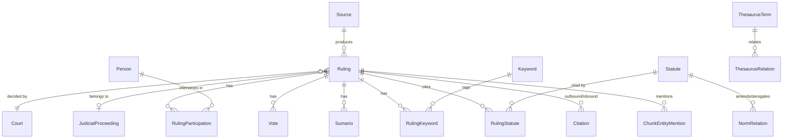

# Knowledge Base Data Model

> The relational data model of the Knowledge Base — ~44 EF Core entities in Azure SQL that hold
> rulings, legislation, actors, the citation/graph layer, ingestion bookkeeping, and data lineage.
>
> This document describes the model as currently implemented (EF Core entities + configurations).
> Legal terms (*fallo*, *sumario*, *dictamen*) are kept in Spanish.

---

## 1. Overview

All persistent state lives in **Azure SQL**, mapped with EF Core (`AppDbContext`, one
`IEntityTypeConfiguration` per entity). The model is **relational** — the "legal graph" is expressed
with explicit relationship/edge tables and polymorphic references (`EntityType` + `EntityId`), not
native SQL Graph node/edge tables. Vectors live in Azure AI Search, not SQL (see
[01 — RAG & Retrieval](01-rag-retrieval.md)).

---

## 2. Legal content

| Entity | Purpose |
|--------|---------|
| `Ruling` | Judicial ruling (*fallo*) — the central entity (see [14 §4](14-csjn-ruling-ingestion.md)) |
| `Sumario` / `SumarioKeyword` | Official doctrinal extracts (*what lawyers cite*) and their *voces* |
| `RulingSynthesis` | Synthesis/review document (CSJN `getSintesisAnalisis`) |
| `ProsecutorOpinion` | Procurador General opinion (*dictamen*) of a CSJN ruling |
| `Vote` | A vote within a collegiate ruling (groups persons voting together) |
| `RulingLink` | Link to a related document (MPF opinion PDF, external doc) |
| `RulingSourceMetadata` | Source-specific fields that don't fit the generic `Ruling` |
| `Statute` | Legal norm (law, decree, resolution…); see [15 §4](15-saij-web-ingestion.md) |
| `RulingStatute` / `RulingStatuteArticle` | Ruling ↔ statute (and specific articles) cited |
| `NormRelation` | Norm → norm edge (derogates / amends / regulates / complements) |
| `LegalDoctrine` | Doctrinal references |

---

## 3. Actors, courts & proceedings

| Entity | Purpose |
|--------|---------|
| `Person` | Master/reference person (physical or legal); `IsVerified`, `CsjnMinistroId` |
| `Court` | Master/reference court; hierarchy via `ParentCourtId`, `Fuero`, `Instance`, `GovernmentLevel` |
| `JudicialOffice` | A person's appointment at a court over time |
| `StateOrgan` | State body (issuing organ for norms, etc.) |
| `RulingParticipation` | Person → ruling in a `RulingRole` (judge, prosecutor…), optional `Vote` |
| `JudicialProceeding` | Groups rulings of the same case across instances (case history) |
| `ProceedingParty` | Person as a party in a proceeding with a `PartyRole` |
| `LegalRepresentation` | A lawyer represents a party in a proceeding |
| `ProceduralRemedy` | Procedural remedies |
| `Keyword` / `RulingKeyword` | Thematic keyword (CSJN `codigoValor`) and ruling ↔ keyword |

---

## 4. Citation & graph layer

The graph is built from explicit edge tables plus polymorphic references:

| Entity | Edge / role |
|--------|-------------|
| `Citation` | Ruling → ruling (typed: `CitationType`). `TargetRulingId` is null until the cited ruling is indexed (retroactively resolved) |
| `ChunkEntityMention` | Chunk → entity (`EntityType` + `EntityId`, `MentionType`, `Confidence`) — GraphRAG local search |
| `GraphCommunity` | A GraphRAG community (cluster) with `Level`, `Summary`, `KeyFindings`, optional parent |
| `CommunityMembership` | Entity (`EntityType` + `EntityId`) → community, with `Relevance` |

Thesaurus terms/relations (`ThesaurusTerm`, `ThesaurusRelation`) form a parallel SKOS graph — see
[13 — SAIJ Thesaurus Ingestion](13-saij-thesaurus-ingestion.md).

---

## 5. Ingestion & pipeline bookkeeping

| Entity | Purpose |
|--------|---------|
| `Source` | Catalog of judicial sources (CSJN=1, SAIJ legislation=2, SAIJ jurisprudence=3, SAIJ thesaurus=6) |
| `CrawlerConfig` | Per-source crawler configuration |
| `Document` | Central pipeline entity tracking a document through the 6 stages |
| `DocumentStageLog` | Per-document per-stage timing (benchmarking) |
| `IngestionJob` / `IngestionJobDetail` | Each ingestion run + per-entity-type metrics; traces which job produced each document |
| `RulingReprocessRequest` | Admin queue entry to fully reprocess a single ruling |
| `WorkerPauseState` | Pause/resume state for pipeline workers |

`DocumentStatus`, `PipelineStage`, `RulingStatus`, `IngestionType` enums drive the flow (see
[14 §2](14-csjn-ruling-ingestion.md)).

---

## 6. Embeddings, provenance & audit

| Entity | Purpose |
|--------|---------|
| `EmbeddingConfig` | Versioned embedding + chunking configuration |
| `RulingEmbeddingState` | Each ruling's embedding state vs the active `EmbeddingConfig` (re-embed tracking) |
| `FieldProvenance` | **Data lineage** — origin of each field value: `SourceId`/`SourceEndpoint`/`SourceField`, `InferenceMethod`, `AiModel`/`AiPrompt`/`AiConfidence`, `IngestionJobId`, `ChangeType` |
| `EntityAuditLog` | Operations on KB entities (`AuditOperation`, `PerformedBy`, `FieldsChanged`, `IngestionJobId`) |
| `ExternalIdentifier` | A local entity's id in an external system |
| `User` | Admin user (Phase 1; Phase 3 syncs with Entra ID) |

`FieldProvenance` and `EntityAuditLog` use polymorphic (`EntityType` + `EntityId`) references so any
entity's field origin and change history can be tracked — the backbone for explainability and
data-quality work (see [09 — Data & Knowledge Management](09-data-knowledge-management.md)).

---

## 7. Cross-cutting modeling notes

- **Master/reference entities** (`Person`, `Court`) carry an `IsVerified` flag — ingested values start
  unverified and can be curated.
- **Polymorphic references** (`EntityType` + `EntityId`) appear in `ChunkEntityMention`,
  `CommunityMembership`, `FieldProvenance`, and `EntityAuditLog`, letting graph/lineage features span
  all entity types without per-type tables.
- **Identity vs. role**: a `Person` (identity) is distinct from contextual roles
  (`RulingParticipation`, `ProceedingParty`, `LegalRepresentation`) — the same person can appear in
  many roles across rulings and proceedings.
- **Deferred edges**: `Citation.TargetRulingId` (and norm relations) may be null until the referenced
  entity is ingested, then resolved retroactively.

---

## 8. Related documentation

- [Argentine Legal Ontology](../ontology/argentine-legal-ontology.md) — the domain model these tables implement
- [KB target domain model (ported reference)](../ontology/kb-domain-model.md) — conceptual target
- [Sources → Ontology → KB mapping (ported reference)](../ontology/source-ontology-kb-mapping.md)
- [14 — CSJN Ruling Ingestion](14-csjn-ruling-ingestion.md) · [15 — SAIJ Web Ingestion](15-saij-web-ingestion.md) · [13 — SAIJ Thesaurus](13-saij-thesaurus-ingestion.md)
- [09 — Data & Knowledge Management](09-data-knowledge-management.md) — lineage, versioning, consistency

---

*Knowledge Base Data Model — Legal Ai Ar*
