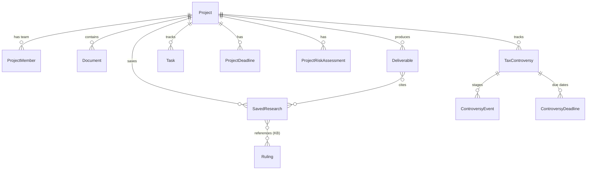

# Business Layer — Projects, Workspaces & Deliverables (target model)

> The **internal business layer** for the PwC tax-legal product: how professionals organize their daily
> work around client **projects/workspaces**, on top of the public legal Knowledge Base.
>
> ⚠️ **Target/planned model — not yet implemented.** These entities do not exist in the MVP; they are
> the design for releases **R2.0–R3.0** (see [`features.md`](../roadmap/features.md)). They **extend**
> the as-built KB data model documented in [17 — KB Data Model](17-kb-data-model.md), which stays.

---

## 1. Overview

The KB layer (rulings, norms, statutes, thesaurus, citation graph) answers _"what does the law say"_.
The **business layer** answers _"what is my team doing for this client"_. The central entity is the
**Project / Workspace** (one per client engagement); everything a professional produces or saves lives
inside a project, with **confidentiality per project** (members see only their projects).

---

## 2. Entities

| Entity                  | Purpose                                    | Key fields                                                                                                   |
| ----------------------- | ------------------------------------------ | ------------------------------------------------------------------------------------------------------------ |
| `Project` (Workspace)   | A client engagement workspace              | `Id`, `Name`, `ClientName`, `Status`, `LeadUserId`, `CreatedAt`, `ConfidentialityLevel`                      |
| `ProjectMember`         | A user's membership + role in a project    | `ProjectId`, `UserId`, `Role` (Manager/Senior/Associate/Viewer)                                              |
| `Document`              | A client document or generated file        | `Id`, `ProjectId`, `Name`, `Type`, `BlobPath`, `UploadedBy`, `Version`, `AnalysisJson?`                      |
| `Deliverable`           | A client output (memo/opinion/report)      | `Id`, `ProjectId`, `Type`, `Title`, `Status` (Draft/Review/Approved), `TemplateId`, `BodyRef`, `ApprovedBy?` |
| `Task`                  | A unit of project work                     | `Id`, `ProjectId`, `Title`, `AssigneeUserId`, `Status`, `DueDate?`                                           |
| `ProjectDeadline`       | A regulatory/tax/contractual due date      | `Id`, `ProjectId`, `Kind`, `DueDate` (business-day computed), `Status`, `AlertLeadDays`                      |
| `SavedResearch`         | Saved query / cited KB items / chat thread | `Id`, `ProjectId`, `Kind` (query/chat/citation), `Payload`, `CitedItems[]`                                   |
| `InternalKnowledgeItem` | PwC internal precedent/memo/opinion        | `Id`, `Title`, `Body`, `Tags`, `SourceProjectId?`, `Confidential`, `EmbeddingState`                          |
| `ProjectRiskAssessment` | Legal/tax/compliance risk analysis         | `Id`, `ProjectId`, `Scenario`, `Score`, `Findings`, `CreatedAt`, `Version`                                   |
| `TaxControversy`        | A tax dispute tracked (light)              | `Id`, `ProjectId`, `Organism` (ARCA/TFN…), `Tax`, `Period`, `Stage`, `Status`, `AmountInDispute`             |
| `ControversyEvent`      | A stage/event in the controversy           | `Id`, `ControversyId`, `Type`, `Date`, `Notes`, `DocumentId?`                                                |
| `ControversyDeadline`   | A procedural/recourse due date             | `Id`, `ControversyId`, `Kind`, `DueDate` (computed), `Status`, `AlertLeadDays`                               |

> `UserId` references the existing `User` entity (KB model). `Document` and `SavedResearch` can link to
> KB items (e.g. cited `Ruling`/`Statute`/dictamen) so deliverables and research stay grounded.

---

## 3. Relationship to the KB layer

- **Grounding:** `SavedResearch` and `Deliverable` reference KB items (rulings, norms, dictámenes) — the
  assistant cites them inline. The KB stays the source of legal truth.
- **Internal KB:** `InternalKnowledgeItem` is indexed (embeddings) alongside the public KB so the
  assistant can cite firm precedents — but filtered by project confidentiality.
- **No change to the KB schema:** the business layer is additive; KB ingestion/search/graph are untouched.

---

## 4. Confidentiality

Access is **project-scoped**: a user sees a project's documents, research, deliverables, and internal
knowledge only if they are a `ProjectMember`. Internal-KB items marked `Confidential` are retrievable by
the assistant only within their owning project (or when explicitly shared). This is critical for
client/secreto-profesional protection (see [06 — AI Security & Compliance](06-ai-security-compliance.md)).

---

## 5. Feature mapping

| Feature                         | Entities                                                               |
| ------------------------------- | ---------------------------------------------------------------------- |
| F2.1 Projects / Workspaces      | `Project`, `ProjectMember`, `Task`, `ProjectDeadline`, `SavedResearch` |
| F2.2 Document review & analysis | `Document` (+ `AnalysisJson`)                                          |
| F2.3 Deliverable generation     | `Deliverable`, references `SavedResearch` + KB                         |
| F2.4 Tasks & deadlines          | `Task`, `ProjectDeadline`                                              |
| F3.1 Internal KB                | `InternalKnowledgeItem`                                                |
| F3.3 Risk analysis              | `ProjectRiskAssessment`                                                |
| F3.4 Tax controversy (light)    | `TaxControversy`, `ControversyEvent`, `ControversyDeadline`            |

---

## 6. Related documentation

- [23 — Transactional Outbox & Domain Events](23-outbox-domain-events.md) — infrastructure for reliable side effects when F2.1 introduces `IAggregateRoot` writes
- [17 — KB Data Model](17-kb-data-model.md) — the as-built public KB model this extends
- [features.md](../roadmap/features.md) — the PwC tax-legal roadmap (R2.0–R3.0)
- [06 — AI Security & Compliance](06-ai-security-compliance.md) — confidentiality / privilege
- [16 — Chat, RAG & Agents](16-chat-rag-agents.md) — grounding / citations the deliverables reuse

---

_Business Layer — Legal Ai Ar (PwC Tax-Legal, target model)_
