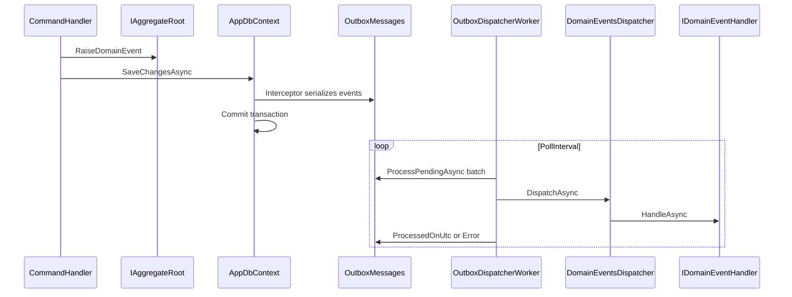

# Transactional Outbox and Domain Events

> **Status:** F00-W12 merged to `main` ([PR #114](https://github.com/pwc-ar-xlos-argentinaaifactory/legal-ai-ar/pull/114), 2026-06-02).
> Infrastructure for reliable intra-API side effects per
> [PwC Internal Application Architecture §4.5](../standards/pwc-internal-app-architecture.md#45-side-effects--outbox-and-queues).
> Consumed by rich aggregates in **F2.1 Projects / Workspaces** (R2.0).

---

## 1. Purpose

| Mechanism                | Use case                                                                                         |
| ------------------------ | ------------------------------------------------------------------------------------------------ |
| **Transactional outbox** | Domain events that must survive process restarts (notifications, audit fan-out, downstream sync) |
| **Azure Storage Queues** | Long-running ingestion pipeline (six workers) — **unchanged**                                    |
| **SignalR**              | Live admin dashboards, worker control                                                            |

The outbox does **not** replace worker queues. It covers **transactional writes in the API** where handlers run after commit.

---

## 2. Flow

---

## 3. Components

| Piece                              | Location                                             | Role                                           |
| ---------------------------------- | ---------------------------------------------------- | ---------------------------------------------- |
| `IDomainEvent`                     | `LegalAiAr.Core/Domain/`                             | Marker for event records                       |
| `IAggregateRoot` / `AggregateRoot` | `LegalAiAr.Core/Domain/`                             | Collect events until save                      |
| `IDomainEventHandler<TEvent>`      | `LegalAiAr.Core/Domain/`                             | Handle one event type (must be **idempotent**) |
| `OutboxMessage`                    | `LegalAiAr.Core/Entities/`                           | Table row (`OutboxMessages`)                   |
| `DispatchDomainEventsInterceptor`  | `LegalAiAr.Infrastructure/Persistence/Interceptors/` | Writes outbox rows on `SaveChanges`            |
| `DomainEventsDispatcher`           | `LegalAiAr.Infrastructure/Outbox/`                   | Deserialize + invoke handlers                  |
| `OutboxMessageProcessor`           | `LegalAiAr.Infrastructure/Outbox/`                   | Batch process pending rows                     |
| `OutboxDispatcherWorker`           | `LegalAiAr.Infrastructure/Outbox/`                   | `BackgroundService` hosted in the **API**      |

Handler registration: `AddDomainEventHandlersFromAssembly` scans `LegalAiAr.Application` for `IDomainEventHandler<>` implementations.

---

## 4. Configuration

`appsettings.json` section `Outbox`:

| Key                   | Default | Description                                                    |
| --------------------- | ------- | -------------------------------------------------------------- |
| `Enabled`             | `true`  | When `false`, the background worker exits immediately          |
| `PollIntervalSeconds` | `5`     | Delay between poll cycles                                      |
| `BatchSize`           | `20`    | Max messages per cycle                                         |
| `MaxRetries`          | `5`     | Stop retrying after this many failures (`Error` stored on row) |

---

## 5. Adding a domain event (F2.1+)

1. Define a `record` implementing `IDomainEvent` in `LegalAiAr.Core/Domain/` (or a feature subfolder under Core).
2. Raise it from an `AggregateRoot` subclass before `SaveChanges`.
3. Implement `IDomainEventHandler<TEvent>` in `LegalAiAr.Application` (side effect logic).
4. Run EF migrations if new aggregate tables are added (outbox table already exists).

**Do not** put domain event types in `LegalAiAr.Api` or `LegalAiAr.Contracts`.

---

## 6. Related documentation

- [21 — Business Layer (target)](./21-business-workspace-model.md) — F2.1 will use this infrastructure for project/workspace side effects
- [19 — Admin & Pipeline Operations](./19-admin-pipeline-operations.md) — ingestion queues and workers
- [PwC architecture §4.5 / §7](../standards/pwc-internal-app-architecture.md) — outbox vs workers vs scheduled jobs

---

_Transactional Outbox — Legal Ai Ar (F00-W12)_
