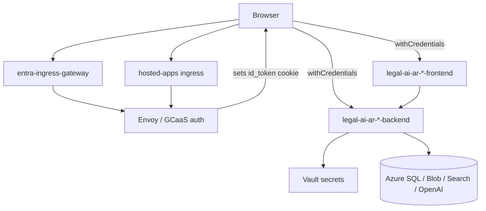

# GCaaS Usage — Legal AI AR

| Field | Value |
|-------|-------|
| **Scope** | Corporate hosting (PwC GCaaS), Entra SSO, Helm/Knative deploy, session model |
| **Last updated** | 2026-05-28 |

---

## Purpose

**GCaaS** (Global Container as a Service) is PwC’s corporate Kubernetes-based platform used to host Legal AI AR for internal users. It provides:

- **Compute**: Knative services for API and SPA containers
- **Ingress**: Istio `VirtualService` routing (legacy host + Entra/`global-caas-*` host)
- **Identity**: Microsoft Entra ID SSO via Envoy; session JWT in the **`id_token`** HTTP-only cookie
- **Secrets**: HashiCorp Vault keys mapped into the release
- **Observability**: Optional Datadog via platform labels

This document is the consolidated reference for GCaaS integration. GitHub-based Azure staging deploy is documented separately in [`github-usage.md`](github-usage.md).

---

## Architecture overview



**URL pattern** (Entra host):

```text
https://{entraHostName}/{engagementId}/{releaseName}-{appName}/
```

Example from [`environment.development.ts`](../../frontend/src/environments/environment.development.ts):

- Host: `https://global-caas-us.pwcglb.com`
- Engagement: `ddf6b108-ced9-4827-a133-9c82141ebf29`
- Release: `legal-ai-ar-main`
- Frontend: `.../legal-ai-ar-main-frontend/`
- Backend: `.../legal-ai-ar-main-backend`

A **legacy** hostname (`metadata.hostName`, e.g. `hosted-apps-us.pwclabs.pwcglb.com`) remains configured until PWC Identity is decommissioned.

---

## Deployment on GCaaS (Helm)

### Chart location

Helm chart root: [`deployment/`](../../deployment/)

| File | Role |
|------|------|
| [`Chart.yaml`](../../deployment/Chart.yaml) | Chart metadata (`legal-ai`) |
| [`values.yaml`](../../deployment/values.yaml) | Apps, auth, secrets keys, configMap, metadata placeholders |
| [`templates/ksvc.yaml`](../../deployment/templates/ksvc.yaml) | Knative Service + Istio VirtualServices |
| [`templates/configmap.yaml`](../../deployment/templates/configmap.yaml) | Non-secret env injection |
| [`templates/secrets.yaml`](../../deployment/templates/secrets.yaml) | Secret references |
| [`templates/daemonset.yaml`](../../deployment/templates/daemonset.yaml) | Optional image preloader |

### Applications in `values.yaml`

| App | Image | Ingress | Notes |
|-----|-------|---------|-------|
| `backend` | `legal-ai-api` (.NET, port 8080) | enabled | API |
| `frontend` | `legal-ai-ui` (Angular, port 8081) | enabled | `minScale: 1` |
| Workers (`crawler`, `parser`, etc.) | Commented out | — | Future / optional on GCaaS |

Images are built by the **GCaaS platform** (`experimentalBuild: true`, language hints `dotnet` / `angular`), not by GitHub Actions in this repo.

### Runtime metadata (platform-injected)

These `values.yaml` entries are **`runtimeReplaced`** at deploy time by GCaaS:

| Key | Purpose |
|-----|---------|
| `metadata.engagementId` | Engagement UUID in URLs and config |
| `metadata.hostName` | Legacy ingress host |
| `metadata.entraHostName` | Entra ingress host (e.g. `global-caas-us.pwcglb.com`) |
| `metadata.commitHash` | Knative revision suffix (`{release}-{app}-{commitHash}`) |

### Authentication flag

```yaml
authentication:
  entra: true
```

When `true` and `metadata.entraHostName` is set, [`ksvc.yaml`](../../deployment/templates/ksvc.yaml) emits a second **VirtualService** (`*-vs-entra`) bound to `istio-system/entra-ingress-gateway` in addition to the default Knative gateway on `metadata.hostName`.

### Secrets (Vault)

Keys in `values.yaml` `secrets:` must exist in Vault; values use `wrappingReplaced` placeholders:

| Vault / env key | Purpose |
|-----------------|---------|
| `AzureSql__ConnectionString` | Database |
| `AzureBlob__ConnectionString` | Blob storage |
| `AzureSearch__ApiKey` | AI Search |
| `AzureOpenAI__ApiKey` | OpenAI |
| `Auth__Platform__TenantId` | Entra tenant for `id_token` validation |
| `Auth__Platform__ValidAudience` | App Registration client id (`aud` claim) |

ConfigMap entries wire Azure endpoints, model deployment names, `ENGAGEMENT_ID`, and `BACKEND_ROOT_URL` / `BACKEND_ROOT_URL_ENTRA`.

### Entry point

```yaml
entrypoint: "https://{{ .Values.metadata.hostName }}/{{ .Values.metadata.engagementId }}/{{ $.Release.Name }}/"
```

Used by the platform launcher (max 63 characters after template render).

### Observability

When `persistentLogging.enabled` is true, pod templates set:

```yaml
gcaas_datadog_enabled: "true"
```

See [`daemonset.yaml`](../../deployment/templates/daemonset.yaml) for optional image preloader (`imagePreloader`).

---

## Identity and session model

### Rule

**Only** users presenting a valid **`id_token`** session cookie are authenticated. The API does **not** accept:

- `X-User-Email` / `X-User-Jwt` headers
- `access_token` for API authorization
- Application-owned login endpoints or Bearer tokens in `localStorage`

See [`auth-jwt-hardening.md`](auth-jwt-hardening.md).

### GCaaS / production flow

1. User opens the frontend URL on the Entra host.
2. GCaaS Envoy completes Microsoft Entra SSO.
3. Browser receives cookies: `id_token`, `access_token`, `refresh_token` (platform-managed).
4. SPA calls `GET /api/auth/me` with **`withCredentials: true`** so `id_token` is sent to the API.
5. API validates JWT (issuer/audience from Vault `TenantId` + `ValidAudience`).
6. SPA refreshes the platform session periodically (see below).

### API configuration (`Auth:Platform`)

| Setting | Env var | Description |
|---------|---------|-------------|
| `TenantId` | `Auth__Platform__TenantId` | Entra tenant → OIDC metadata |
| `ValidAudience` | `Auth__Platform__ValidAudience` | Expected `aud` in `id_token` |
| `IdTokenCookie` | `Auth__Platform__IdTokenCookie` | Cookie name (default `id_token`) |
| `MetadataAddress` | `Auth__Platform__MetadataAddress` | Optional explicit OIDC discovery URL |
| `SigningKeyBase64` | `Auth__Platform__SigningKeyBase64` | Local dev / tests only |
| `DefaultRole` | `Auth__Platform__DefaultRole` | Fallback role if JWT has none (`admin`) |
| `EmailClaim` / `RolesClaimType` | — | Claim mapping (default `email`, `roles`) |

Full matrix: [`auth-api-runbook.md`](auth-api-runbook.md).

### Local development (simulated GCaaS)

When `ASPNETCORE_ENVIRONMENT=Development` and `Auth:Development:InjectIdentity=true`:

- [`DevelopmentPlatformAuthMiddleware`](../../backend/src/api/LegalAiAr.Api/Middleware/DevelopmentPlatformAuthMiddleware.cs) issues a signed `id_token` cookie if missing.
- [`DevelopmentSessionTokenIssuer`](../../backend/src/api/LegalAiAr.Api/Services/DevelopmentSessionTokenIssuer.cs) signs the dev JWT (`SigningKeyBase64` in `appsettings.Development.json`).

Set `Auth:Development:InjectIdentity=false` to test 401 responses locally.

---

## API endpoints (auth-related)

| Endpoint | Auth | Behavior |
|----------|------|----------|
| `GET /api/auth/me` | Required | Returns email, display name, role, groups from validated principal |
| `POST /api/auth/logout` | Required | API ack; **GCaaS logout** is SPA redirect to platform URL |
| `GET /api/health/live` | Anonymous | Liveness |
| `GET /api/health` | Required | Health with auth |

[`AuthController`](../../backend/src/api/LegalAiAr.Api/Controllers/AuthController.cs) — identity from validated cookie, not custom login.

### Worker SignalR hub

`/hubs/worker-control` — policy **`WorkerControlHub`**: authenticated user **or** header `X-Worker-Hub-Key` matching `WorkerControl:HubAccessKey`.

---

## Angular SPA (GCaaS builds)

### Build configurations

| Angular config | Environment file | Use case |
|----------------|------------------|----------|
| `development` | `environment.development.ts` | GCaaS cloud build (explicit `global-caas` URLs + `baseHref`) |
| `production` | `environment.prod.ts` | GCaaS production (same-origin relative `apiUrl`) |
| `staging` | `environment.staging.ts` | **Azure** staging via GitHub CD — **not** GCaaS |
| `local` | `environment.ts` | Local `ng serve` |

[`angular.json`](../../frontend/angular.json) — `development` sets `baseHref` to `/{engagementId}/{release}-frontend/`.

### Environment fields (`LegalAiArEnvironment`)

| Field | GCaaS typical value | Purpose |
|-------|---------------------|---------|
| `usePlatformCredentials` | `true` | Enable `withCredentials` on HTTP calls |
| `gcaasEngagementId` | Engagement UUID | Refresh/logout path construction |
| `platformLoginUrl` | Full Entra frontend URL | SSO button on session gate |
| `platformSessionRefreshPath` | `/{engagementId}/refresh` | Session refresh (relative to origin) |
| `platformLogoutPath` | `/{engagementId}/logout` | Logout redirect |
| `platformSessionRefreshIntervalMs` | `2700000` (45 min) | Refresh interval |
| `platformAuthFailurePath` | `sesion-requerida` | Route when session invalid |
| `apiUrl` | Sibling backend URL or `''` (same origin) | API base |

### Startup and session lifecycle

1. **`APP_INITIALIZER`** → `AuthService.bootstrapSession()` → `GET /api/auth/me` (20s timeout).
2. **`platformCredentialsInterceptor`** — adds `withCredentials: true` when `usePlatformCredentials` is true.
3. **`startGcaasSessionRefresh()`** — every 45 minutes (default), `GET /{engagementId}/refresh` with `credentials: 'include'`. GCaaS does **not** auto-refresh; `id_token` lifetime is ~1 hour.
4. On refresh **401**, clear local session and navigate to `sesion-requerida`.
5. **Logout** — if `getGcaasLogoutUrl()` is set, redirect to platform logout; else `POST /api/auth/logout`.

Helpers: [`platform-urls.ts`](../../frontend/src/app/services/platform-urls.ts).

### Session required gate

Route `sesion-requerida` → [`session-required.component.ts`](../../frontend/src/app/features/auth/session-required/session-required.component.ts): branded page with link to `platformLoginUrl` for corporate SSO.

No `/login` route; no Bearer token storage.

---

## Post-deploy verification checklist

1. Open: `https://{entraHostName}/{engagementId}/{release}-frontend/`
2. Complete Microsoft Entra login (stage may require `@testenv.pwc.com`).
3. Confirm browser cookies: `id_token`, `access_token`, `refresh_token`.
4. Confirm `GET .../api/auth/me` returns **200** (browser Network tab).
5. Confirm legacy URL on `hosted-apps-*` still works until PWC Identity decommission.
6. If **503** on Entra domain: verify `*-vs-entra` VirtualService exists in the namespace.

### Platform session URLs

| Action | Method | Path |
|--------|--------|------|
| Refresh session | `GET` | `/{engagementId}/refresh` |
| Logout | `GET` | `/{engagementId}/logout` |

Host: `global-caas-*` (Entra ingress), not the Azure staging URLs.

---

## GCaaS vs Azure staging (GitHub CD)

| Aspect | GCaaS | Azure staging (GHA) |
|--------|-------|---------------------|
| Deploy | Helm / platform pipeline | `.github/workflows/cd.yml` |
| SPA config | `development` / `production` | `staging` |
| Auth | `id_token` cookie + Entra | `usePlatformCredentials: false` |
| API URL | Under engagement path on corporate host | `*.azurewebsites.net` |

Both may share the same Azure SQL, Blob, Search, and OpenAI backends.

---

## Troubleshooting

| Symptom | Likely cause | Action |
|---------|--------------|--------|
| 401 on `/api/auth/me` | Missing or expired `id_token` | Re-login via `platformLoginUrl`; check refresh timer |
| Invalid or expired `id_token` | Wrong `TenantId` / `ValidAudience` in Vault | Decode browser cookie; align Vault with `aud` / tenant |
| Missing id_token session cookie | Cookie not sent cross-origin | Ensure `usePlatformCredentials` and same-site corporate host |
| 503 on Entra URL | Missing `*-vs-entra` VirtualService | Check `authentication.entra` and `entraHostName` in release |
| Session drops after ~1 h | Refresh not running | Verify `gcaasEngagementId` and refresh path; check Network for `/refresh` |

---

## Relevant files

### Helm / platform deployment

| Path | Description |
|------|-------------|
| [`deployment/Chart.yaml`](../../deployment/Chart.yaml) | Helm chart metadata |
| [`deployment/values.yaml`](../../deployment/values.yaml) | Apps, Entra flag, secrets, configMap, metadata |
| [`deployment/.helmignore`](../../deployment/.helmignore) | Helm ignore rules |
| [`deployment/templates/ksvc.yaml`](../../deployment/templates/ksvc.yaml) | Knative Service, VirtualServices (legacy + Entra) |
| [`deployment/templates/configmap.yaml`](../../deployment/templates/configmap.yaml) | ConfigMap template |
| [`deployment/templates/secrets.yaml`](../../deployment/templates/secrets.yaml) | Secrets template |
| [`deployment/templates/daemonset.yaml`](../../deployment/templates/daemonset.yaml) | Preloader / Datadog-related daemonset |

### Backend — platform authentication

| Path | Description |
|------|-------------|
| [`backend/src/api/LegalAiAr.Api/Program.cs`](../../backend/src/api/LegalAiAr.Api/Program.cs) | Registers platform auth scheme |
| [`backend/src/api/LegalAiAr.Api/Services/PlatformAuthOptions.cs`](../../backend/src/api/LegalAiAr.Api/Services/PlatformAuthOptions.cs) | Configuration model |
| [`backend/src/api/LegalAiAr.Api/Services/PlatformAuthConfigurer.cs`](../../backend/src/api/LegalAiAr.Api/Services/PlatformAuthConfigurer.cs) | OIDC / validation setup |
| [`backend/src/api/LegalAiAr.Api/Services/PlatformAuthenticationHandler.cs`](../../backend/src/api/LegalAiAr.Api/Services/PlatformAuthenticationHandler.cs) | ASP.NET Core auth handler |
| [`backend/src/api/LegalAiAr.Api/Services/PlatformGatewayTokenResolver.cs`](../../backend/src/api/LegalAiAr.Api/Services/PlatformGatewayTokenResolver.cs) | Reads `id_token` cookie |
| [`backend/src/api/LegalAiAr.Api/Services/PlatformUserJwtValidator.cs`](../../backend/src/api/LegalAiAr.Api/Services/PlatformUserJwtValidator.cs) | JWT validation |
| [`backend/src/api/LegalAiAr.Api/Services/PlatformJwtPrincipalNormalizer.cs`](../../backend/src/api/LegalAiAr.Api/Services/PlatformJwtPrincipalNormalizer.cs) | Claims normalization |
| [`backend/src/api/LegalAiAr.Api/Services/PlatformRoleResolver.cs`](../../backend/src/api/LegalAiAr.Api/Services/PlatformRoleResolver.cs) | Entra/platform role → app role |
| [`backend/src/api/LegalAiAr.Api/Services/DevelopmentAuthOptions.cs`](../../backend/src/api/LegalAiAr.Api/Services/DevelopmentAuthOptions.cs) | Dev injection settings |
| [`backend/src/api/LegalAiAr.Api/Services/DevelopmentSessionTokenIssuer.cs`](../../backend/src/api/LegalAiAr.Api/Services/DevelopmentSessionTokenIssuer.cs) | Dev signed `id_token` |
| [`backend/src/api/LegalAiAr.Api/Middleware/DevelopmentPlatformAuthMiddleware.cs`](../../backend/src/api/LegalAiAr.Api/Middleware/DevelopmentPlatformAuthMiddleware.cs) | Injects dev cookie |
| [`backend/src/api/LegalAiAr.Api/Middleware/DevelopmentPlatformAuthMiddlewareExtensions.cs`](../../backend/src/api/LegalAiAr.Api/Middleware/DevelopmentPlatformAuthMiddlewareExtensions.cs) | Middleware registration |
| [`backend/src/api/LegalAiAr.Api/Controllers/AuthController.cs`](../../backend/src/api/LegalAiAr.Api/Controllers/AuthController.cs) | `/api/auth/me`, `/logout` |
| [`backend/src/api/LegalAiAr.Api/appsettings.json`](../../backend/src/api/LegalAiAr.Api/appsettings.json) | `Auth:Platform` section scaffold |
| [`backend/src/api/LegalAiAr.Api/appsettings.Development.json`](../../backend/src/api/LegalAiAr.Api/appsettings.Development.json) | Dev auth injection defaults |

### Backend — tests

| Path | Description |
|------|-------------|
| [`backend/tests/LegalAiAr.Api.Tests/AuthAndHealthAuthorizationTests.cs`](../../backend/tests/LegalAiAr.Api.Tests/AuthAndHealthAuthorizationTests.cs) | Auth / health authorization |
| [`backend/tests/LegalAiAr.Api.Tests/PlatformGatewayTokenResolverTests.cs`](../../backend/tests/LegalAiAr.Api.Tests/PlatformGatewayTokenResolverTests.cs) | Cookie resolver tests |
| [`backend/tests/LegalAiAr.Api.Tests/JwtTestTokenFactory.cs`](../../backend/tests/LegalAiAr.Api.Tests/JwtTestTokenFactory.cs) | Test JWT helpers |

### Frontend — GCaaS session and environments

| Path | Description |
|------|-------------|
| [`frontend/src/environments/environment.model.ts`](../../frontend/src/environments/environment.model.ts) | Shared environment interface |
| [`frontend/src/environments/environment.development.ts`](../../frontend/src/environments/environment.development.ts) | GCaaS cloud build (Entra host URLs) |
| [`frontend/src/environments/environment.prod.ts`](../../frontend/src/environments/environment.prod.ts) | GCaaS production (same-origin) |
| [`frontend/src/environments/environment.ts`](../../frontend/src/environments/environment.ts) | Local default |
| [`frontend/angular.json`](../../frontend/angular.json) | `development` / `production` configs and `baseHref` |
| [`frontend/src/app/services/auth.service.ts`](../../frontend/src/app/services/auth.service.ts) | Bootstrap, refresh, logout |
| [`frontend/src/app/services/platform-urls.ts`](../../frontend/src/app/services/platform-urls.ts) | Refresh/logout URL builders |
| [`frontend/src/app/interceptors/platform-credentials.interceptor.ts`](../../frontend/src/app/interceptors/platform-credentials.interceptor.ts) | `withCredentials` for API calls |
| [`frontend/src/app/interceptors/error.interceptor.ts`](../../frontend/src/app/interceptors/error.interceptor.ts) | 401 → session gate |
| [`frontend/src/app/guards/auth.guard.ts`](../../frontend/src/app/guards/auth.guard.ts) | Route protection |
| [`frontend/src/app/features/auth/session-required/session-required.component.ts`](../../frontend/src/app/features/auth/session-required/session-required.component.ts) | SSO gate UI |
| [`frontend/src/app/app.config.ts`](../../frontend/src/app/app.config.ts) | `APP_INITIALIZER`, interceptors |
| [`frontend/src/app/app.routes.ts`](../../frontend/src/app/app.routes.ts) | Includes `sesion-requerida` route |

### Documentation and configuration samples

| Path | Description |
|------|-------------|
| [`docs/design/auth-api-runbook.md`](auth-api-runbook.md) | Auth endpoints, SPA behavior, Helm Entra checklist |
| [`docs/design/auth-jwt-hardening.md`](auth-jwt-hardening.md) | `id_token`-only rule and Vault keys |
| [`.env.example`](../../.env.example) | `Auth__Platform__*` variable names |
| [`docs/design/github-usage.md`](github-usage.md) | GitHub / Azure path (complementary) |

---

## References

- [`auth-api-runbook.md`](auth-api-runbook.md) — operational runbook (historical name; covers GCaaS auth)
- [`auth-jwt-hardening.md`](auth-jwt-hardening.md) — session cookie rules
- [`github-usage.md`](github-usage.md) — GitHub Actions and Azure staging
- [`f1-14-deploy.md`](f1-14-deploy.md) — overall deploy strategy
