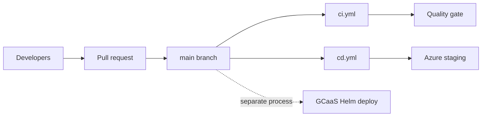

# GitHub Usage — Legal AI AR

| Field | Value |
|-------|-------|
| **Scope** | Source control, CI quality gates, CD to Azure staging |
| **Last updated** | 2026-05-28 |

---

## Purpose

This document describes how the Legal AI AR project uses **GitHub** today: branching, automation workflows, secrets, and how that pipeline relates to (and differs from) **GCaaS** corporate hosting. For GCaaS runtime, auth, and Helm deployment, see [`gcaas-usage.md`](gcaas-usage.md).

---

## Role in the overall delivery model

GitHub is the **canonical source of truth** for application code. Two automation workflows run on GitHub-hosted runners:

| Workflow | File | Trigger | Outcome |
|----------|------|---------|---------|
| **CI** | `.github/workflows/ci.yml` | Push or PR to `main` | Build, test, format check — no deploy |
| **CD** | `.github/workflows/cd.yml` | Push to `main` (merge) | Build artifacts and deploy API + SPA to **Azure staging** |

GitHub Actions **does not deploy to GCaaS**. GCaaS releases use the Helm chart under `deployment/` and the platform’s own deployment pipeline (see [`gcaas-usage.md`](gcaas-usage.md)).

---

## Repository and branching

| Branch / pattern | Purpose |
|------------------|---------|
| `main` | Production-ready code. Triggers CI on PR/push and CD on push. |
| `feature/*` | Feature work; merge into `main` via pull request. |
| `develop` | Optional integration branch (documented in deploy strategy; Phase 1 can use `main` only). |

**Design reference**: [`f1-14-deploy.md`](f1-14-deploy.md) §1 (branching model).

**Pull requests**: CI must pass (build, tests, `dotnet format`) before merge to `main`.

---

## CI pipeline (`ci.yml`)

**Name**: `CI`  
**Triggers**:

- `push` to `main`
- `pull_request` targeting `main`

**Runner**: `ubuntu-latest`

**Steps** (single job `build-and-test`):

1. **Checkout** — `actions/checkout@v4`
2. **Setup .NET** — `actions/setup-dotnet@v4`, SDK `10.0.x`
3. **Restore** — `dotnet restore backend/LegalAiAr.sln`
4. **Build** — `dotnet build backend/LegalAiAr.sln -c Release --no-restore`
5. **Test** — `dotnet test backend/LegalAiAr.sln -c Release --no-build`
6. **Lint** — `dotnet format backend/LegalAiAr.sln --verify-no-changes`

**Scope note**: CI covers the **backend solution only**. The Angular SPA is not built or tested in this workflow.

**Diagram**: [`f0-1-ci-pipeline.mermaid`](f0-1-ci-pipeline.mermaid)

---

## CD pipeline (`cd.yml`)

**Name**: `CD`  
**Trigger**: `push` to `main` only  
**Roadmap**: F1-14 T-05 (marked complete in [`ROADMAP.md`](../roadmap/ROADMAP.md))

### Jobs overview

| Job | Depends on | Deploy target |
|-----|------------|---------------|
| `build-and-test` | — | Publishes API artifact |
| `build-spa` | — | Publishes SPA artifact (`--configuration=staging`) |
| `deploy-api` | `build-and-test` | Azure App Service **staging** slot |
| `deploy-spa` | `build-spa` | Azure Static Web Apps |

Deploy jobs run only when `github.ref == 'refs/heads/main'` and use the GitHub **environment** named `staging`.

### `build-and-test`

Same .NET steps as CI, plus:

- `dotnet publish backend/src/api/LegalAiAr.Api/LegalAiAr.Api.csproj -c Release -o api-publish`
- Upload artifact `api-publish`

### `build-spa`

- Node `20`, `npm ci` in `frontend/`
- `npm run build --prefix frontend -- --configuration=staging`
- Upload artifact `spa-dist` from `frontend/dist/legal-ai-ar`

The **staging** Angular configuration uses [`environment.staging.ts`](../../frontend/src/environments/environment.staging.ts): API at `legal-ai-ar-api-staging.azurewebsites.net`, `usePlatformCredentials: false` (no GCaaS cookie flow).

### `deploy-api`

- Download `api-publish` artifact
- `azure/login@v2` with `secrets.AZURE_CREDENTIALS`
- `azure/webapps-deploy@v3` to App Service:
  - App name: `vars.APP_SERVICE_NAME` or default `legal-ai-ar-api`
  - Slot: `staging`

### `deploy-spa`

- Download `spa-dist` artifact
- `Azure/static-web-apps-deploy@v1` with `secrets.AZURE_STATIC_WEB_APPS_API_TOKEN`
- Uses `secrets.GITHUB_TOKEN` as `repo_token`

### CD vs design target

[`f1-14-deploy.md`](f1-14-deploy.md) and [`f1-14-cd-pipeline.mermaid`](f1-14-cd-pipeline.mermaid) describe a fuller target flow (worker images to ACR, Container Apps, smoke test, slot swap to production). The **implemented** `cd.yml` currently deploys **API + SPA to staging only**; worker deploy and production promotion are not in the workflow file yet.

---

## GitHub configuration (secrets and environments)

Configure under **Settings → Secrets and variables → Actions** and **Settings → Environments**.

| Name | Type | Used by | Purpose |
|------|------|---------|---------|
| `AZURE_CREDENTIALS` | Secret | `deploy-api` | Service principal JSON for `azure/login` |
| `AZURE_STATIC_WEB_APPS_API_TOKEN` | Secret | `deploy-spa` | Static Web Apps deployment token |
| `GITHUB_TOKEN` | Built-in | `deploy-spa` | SWA deploy action `repo_token` |
| `ACR_LOGIN_SERVER`, `ACR_USERNAME`, `ACR_PASSWORD` | Secret (commented in workflow header) | Not used in current jobs | Reserved for container image push |
| `APP_SERVICE_NAME` | Variable (optional) | `deploy-api` | Override default `legal-ai-ar-api` |

**Environment**: Create `staging` under **Environments** (optional protection rules / required reviewers).

**Setup guide**: [`infra/README.md`](../../infra/README.md) § T-05 — CD Pipeline.

---

## Azure resources touched by GitHub CD

| Component | Staging target | Provisioning |
|-----------|----------------|--------------|
| API | App Service staging slot | `infra/scripts/create-app-service.ps1` |
| SPA | Azure Static Web Apps | `infra/scripts/create-static-web-app.ps1`, Portal/CLI |
| Workers | Container Apps (design) | Not deployed by current `cd.yml` |
| Data plane | Azure SQL, Blob, Search, OpenAI | Shared; configured in App Service settings, not by GHA |

**Verification**: [`docs/setup/staging-verification-tutorial.md`](../setup/staging-verification-tutorial.md)

---

## Documentation and diagrams on GitHub

- **Mermaid** diagrams under `docs/design/` and `docs/architecture/` are intended to render in GitHub, VS Code, and Mermaid Live ([`c4-diagrams.md`](../architecture/c4-diagrams.md)).
- **PlantUML** C4 variants with Azure icons are for local/IDE rendering; GitHub uses Mermaid.

---

## Relationship to GCaaS

| Aspect | GitHub / Azure path | GCaaS path |
|--------|---------------------|------------|
| Deploy trigger | Merge to `main` → GHA | Platform Helm deploy (separate) |
| SPA build config | `staging` | `development` or `production` (Angular) |
| Auth | Staging API without platform cookies | Entra + `id_token` cookie |
| Infra scripts | `infra/scripts/*.ps1` | `deployment/` Helm chart |

Both paths can target the **same Azure data services**; compute and identity boundaries differ.

---

## Operational checklist

### Enable CD for a new fork or org

1. Create Azure App Service (with staging slot) and Static Web App.
2. Add secrets `AZURE_CREDENTIALS`, `AZURE_STATIC_WEB_APPS_API_TOKEN`.
3. Create GitHub environment `staging`.
4. Merge to `main` and confirm workflow runs in **Actions** tab.

### Rollback (Azure staging)

- **API**: Redeploy a previous commit via workflow re-run, or swap App Service slots per [`f1-14-deploy.md`](f1-14-deploy.md) §3.
- **SPA**: Restore previous deployment in Static Web Apps portal or redeploy from pipeline history.

---

## Relevant files

### Workflows and automation

| Path | Description |
|------|-------------|
| [`.github/workflows/ci.yml`](../../.github/workflows/ci.yml) | CI: build, test, format |
| [`.github/workflows/cd.yml`](../../.github/workflows/cd.yml) | CD: Azure staging deploy |

### Design and runbooks

| Path | Description |
|------|-------------|
| [`docs/design/f0-1-ci-pipeline.mermaid`](f0-1-ci-pipeline.mermaid) | CI flow diagram |
| [`docs/design/f1-14-deploy.md`](f1-14-deploy.md) | Branching, slots, rollback, env vars |
| [`docs/design/f1-14-cd-pipeline.mermaid`](f1-14-cd-pipeline.mermaid) | Target CD flow (broader than current workflow) |
| [`docs/setup/staging-verification-tutorial.md`](../setup/staging-verification-tutorial.md) | Staging smoke / verification |
| [`docs/roadmap/ROADMAP.md`](../roadmap/ROADMAP.md) | F1-14 T-05 CD task tracking |
| [`infra/README.md`](../../infra/README.md) | Azure scripts and GHA secret setup |

### Infrastructure scripts (Azure, not executed by GHA in-repo)

| Path | Description |
|------|-------------|
| [`infra/scripts/create-app-service.ps1`](../../infra/scripts/create-app-service.ps1) | App Service + staging slot |
| [`infra/scripts/create-static-web-app.ps1`](../../infra/scripts/create-static-web-app.ps1) | Static Web Apps |
| [`infra/scripts/create-container-registry.ps1`](../../infra/scripts/create-container-registry.ps1) | ACR (workers / future CD) |
| [`infra/scripts/create-storage-queues.ps1`](../../infra/scripts/create-storage-queues.ps1) | Pipeline queues |
| [`infra/scripts/verify-azure-connectivity.ps1`](../../infra/scripts/verify-azure-connectivity.ps1) | Connectivity checks |
| [`infra/scripts/verify-azure-openai.ps1`](../../infra/scripts/verify-azure-openai.ps1) | OpenAI checks |

### Application config used by GitHub CD (SPA staging)

| Path | Description |
|------|-------------|
| [`frontend/src/environments/environment.staging.ts`](../../frontend/src/environments/environment.staging.ts) | API URL for Azure staging build |
| [`frontend/angular.json`](../../frontend/angular.json) | `staging` build configuration |
| [`frontend/package.json`](../../frontend/package.json) | SPA build scripts |

### Related (cross-reference only)

| Path | Description |
|------|-------------|
| [`docs/design/gcaas-usage.md`](gcaas-usage.md) | GCaaS platform (not deployed via GitHub Actions) |
| [`README.md`](../../README.md) | Project overview and doc index |

---

## References

- [GitHub Actions documentation](https://docs.github.com/en/actions)
- [Azure/login action](https://github.com/Azure/login)
- [Azure Web Apps deploy action](https://github.com/Azure/webapps-deploy)
- [Azure Static Web Apps deploy action](https://github.com/Azure/static-web-apps-deploy)
